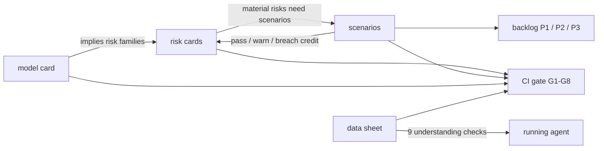

# Agentic AI model risk: four pillars, five enterprise agents, one CI gate

[](https://github.com/jagadishmazure-jpg/Jagadish-agentic-ai-model-risk/actions/workflows/ci.yml)
[](https://github.com/jagadishmazure-jpg/Jagadish-agentic-ai-model-risk/actions/workflows/infra.yml)

## At a glance (for recruiters)

- **Model risk management for agentic AI as working code.** Model cards, data sheets, risk cards and
  scenario planning (the four pillars described by the Cloud Security Alliance) are JSON Schemas plus
  YAML for each model, and code connects them: the model card implies risks, the data sheet is tested
  against the running model, risks drive scenarios, and scenario results update residual risk and
  generate a development backlog.
- **Five fictional enterprise agents** (LangGraph-style, offline, mock model, synthetic data):
  Halcyon Trust Bank fraud triage, Bramblewood Mutual claims, Cedar Hollow Lending underwriting
  assistant (fair lending: adverse impact ratio 0.955, zero matched-pair flips), Juniper Health Plan
  prior authorization (PHI masking, not a medical device, no deny tool), Marigold Market pricing
  and demand.
- **43 scenarios across eight families** (data drift, prompt injection, tool misuse, model outage,
  bias, hallucination, PII leak, cost spike). Each one runs with controls on (the gate) and with its
  control switched off (the what-if) to prove the control is needed.
- **48 risks scored likelihood × impact**, inherent vs residual, with owners and controls. Three are
  critical before treatment, and all are within appetite after tested controls.
- **Governance:** an inventory with computed tiers and EU AI Act classes, lifecycle approval gates
  (development, validation, production, monitoring, retirement), independent validation that
  re-runs the card's metrics, drift and performance monitoring, HITL sign-off bound to a digest
  with a hash-chained audit log, and a read-only MCP server over the risk register.
- **A CI gate** that fails if a pillar is missing, a high risk has no control or a scenario breaches,
  among eight checks.
- **Regulatory mapping in my own words:** NIST AI RMF, EU AI Act tiers, SR 11-7, ISO/IEC 42001, HIPAA
  and fair lending. **Portfolio cross-link:** cards that govern components of my five other repos.
- **Terraform + Bicep** evidence plane (Azure Policy for required model-card tags, Log Analytics
  workbook, keyless evidence storage, smallest SKUs). GitHub Actions use OIDC with dev → prod
  approval, and deployment is switched off.
- **592 automated tests**, all offline, plus 33 complete component docs whose outputs and code
  excerpts are regenerated and drift-checked in CI.

**Skills demonstrated:** AI governance and model risk management (SR 11-7, NIST AI RMF, EU AI Act,
ISO/IEC 42001), agentic AI safety (prompt injection, tool authorization, HITL), fairness testing,
Microsoft Foundry evaluations, Azure Policy, Purview, Application Insights, MCP, Terraform, Bicep,
GitHub Actions (OIDC) and Python.

*Honesty note: all companies, people and data are fictional and synthetic. The language model is a
deterministic mock, the injection screen and PII masking are regex stand-ins, sign-offs are seeded
demo records, and nothing is deployed to Azure.*

## Attribution

The four-pillar structure (model cards, data sheets, risk cards, scenario planning, used together)
comes from the Cloud Security Alliance AI Technology and Risk working group's AI Model Risk
Management Framework: [https://cloudsecurityalliance.org/research/working-groups/ai-technology-and-risk](https://cloudsecurityalliance.org/research/working-groups/ai-technology-and-risk). The framework document is **not** included or redistributed
here, and nothing in this repository copies its text. Schemas, scoring, scenarios, code and wording
are this repository's own. Please read the framework on the CSA site.

## Quick start

```bash
python -m venv .venv && source .venv/bin/activate
pip install -e ".[dev]"
pytest -q
modelrisk gate
modelrisk inventory
modelrisk whatif --model juniper-prior-auth
modelrisk combine --model halcyon-fraud-triage
```

<!-- output: inventory -->
```text
model                               domain           stage        tier  points  EU AI Act
----------------------------------  ---------------  -----------  ----  ------  ---------
halcyon-fraud-triage                banking          monitoring   1     11      minimal
bramblewood-claims-triage           insurance        production   1     9       minimal
cedarhollow-underwriting-assistant  mortgage         validation   1     9       high-risk
juniper-prior-auth                  healthcare       validation   1     10      high-risk
marigold-pricing-demand             retail           monitoring   2     5       minimal
pfa-mortgage-flow                   mortgage         production   1     9       high-risk
pfs-safety-layer                    platform-safety  production   2     5       minimal
pal-agent-labs                      research         development  3     0       minimal
pfb-fabric-data-agent               analytics        production   2     1       minimal
pff-finops-agent                    finops           production   3     3       minimal
```
<!-- /output -->

## Domain summary

| Domain | Fictional company | Tier / EU AI Act | Top risks (inherent → residual) | Scenarios |
|---|---|---|---|---|
| Banking fraud triage | Halcyon Trust Bank | 1 / minimal (fraud carve-out) | BNK-R1 drift 16 → 3.36 | 8 pass; BNK-S7 does not exercise its control (P3) |
| Insurance claims | Bramblewood Mutual | 1 / minimal | INS-R1 staged losses 12 → 2.52 | 7 pass |
| Mortgage underwriting | Cedar Hollow Lending | 1 / high-risk | MTG-R1 proxy disparate impact 20 → 1.6 | 8 pass; AIR 0.955 (about 0.35 with proxy) |
| Healthcare prior auth | Juniper Health Plan | 1 / high-risk | HC-R1 PHI exposure 20 → 1.8 | 7 pass, HC-S7 cost in warn band (P2) |
| Retail pricing | Marigold Market | 2 / minimal | RTL-R3 price guardrail 12 → 1.8 | 7 pass |

<!-- output: risks --band critical -->
```text
model                               risk    category          L  I  inherent     controls  residual  owner
----------------------------------  ------  ----------------  -  -  -----------  --------  --------  ---------------
juniper-prior-auth                  HC-R1   legal-regulatory  4  5  20 critical  2         1.8 low   Privacy Office
cedarhollow-underwriting-assistant  MTG-R1  legal-regulatory  4  5  20 critical  2         1.6 low   Compliance
halcyon-fraud-triage                BNK-R1  operational       4  4  16 critical  2         3.36 low  Rhea Castellano
3 risks
```
<!-- /output -->

## How the pillars combine



## Repository map

| Path | What it holds |
|---|---|
| `schemas/` | JSON Schemas for every artifact |
| `registry/` | Ten models: four pillars + approvals each, inventory, audit log |
| `src/modelrisk/` | Agents, scenario engine, governance, CLI, MCP server |
| `regulatory/` | Framework mapping |
| `infra/` | Terraform, Bicep, policies, workbook |
| `docs/` | Pillars, domains, scenarios, components, infra, guides, ADRs |
| `tests/` | 592 tests |

Start with [docs/implementation-guide.md](docs/implementation-guide.md), then
[docs/pillars/combining-the-pillars.md](docs/pillars/combining-the-pillars.md),
[docs/regulatory-mapping.md](docs/regulatory-mapping.md) and
[docs/interview-guide.md](docs/interview-guide.md).

## Open gaps

- Portfolio scenarios are attested from the other repositories' CI, not re-run here
  (`modelrisk portfolio --verify` re-runs them locally when sibling checkouts exist).
- Mock model and synthetic data; a real deployment would use Foundry evaluations with sampling.
- Regex injection screen and masking stand in for Prompt Shields and Azure AI Language PII detection.
- Sign-offs are seeded demo records and expire after 365 days; rerun `scripts/seed_signoffs.py`.
- The mortgage and healthcare agents are held in validation, waiting for compliance (and clinical reviewer) sign-offs.
- Planned controls (BNK-C3, BNK-C13, MTG-C3) are on the backlog and earn no credit.
- Nothing is deployed.

## License

MIT for this repository's code and docs. The CSA framework is not covered by this license and is not included.
