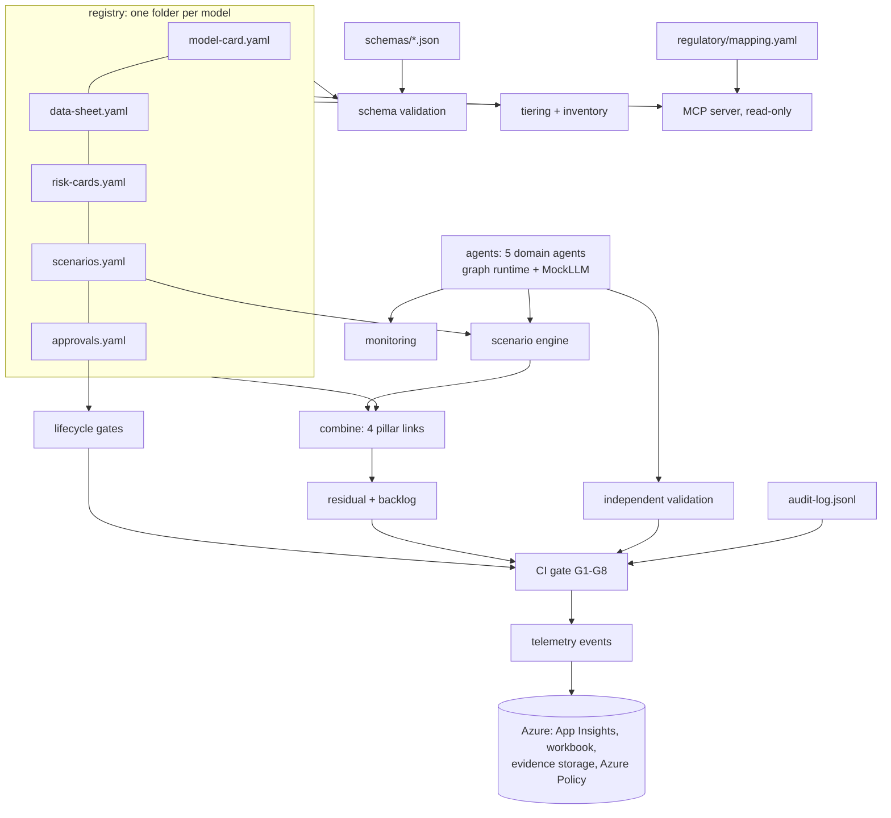

# Architecture

## Layers

| Layer | Code | Docs |
|---|---|---|
| Pillars (artifacts + schemas) | `schemas/`, `registry/` | `docs/pillars/` |
| Agents | `src/modelrisk/agents/` | `docs/domains/`, `docs/components/agent-runtime.md` |
| Scenario engine | `src/modelrisk/scenarios/` | `docs/scenarios/` |
| Governance | `tiering.py`, `combine.py`, `lifecycle.py`, `validation.py`, `monitoring.py`, `signoff.py`, `gate.py` | `docs/components/` |
| Interfaces | `cli.py`, `mcp_server.py`, `telemetry.py` | `docs/components/` |
| Infrastructure | `infra/` | `docs/infra/` |

## Azure mapping

| Concern | Here | Azure |
|---|---|---|
| Model hosting | MockLLM | Microsoft Foundry deployments |
| Evaluations | scenario engine | Foundry evaluations and red teaming agent |
| Injection screen | regex | Azure AI Content Safety Prompt Shields |
| PII/PHI masking | regex | Azure AI Language PII detection |
| Data governance | data sheets | Microsoft Purview |
| Resource guardrails | tests on tags | Azure Policy (`infra/policies`) |
| Telemetry | JSON lines | Application Insights + Log Analytics workbook |
| Evidence | `evidence/` | Storage account, versioned, keyless |

Pillar structure credited to the [CSA AI Technology and Risk working group](https://cloudsecurityalliance.org/research/working-groups/ai-technology-and-risk).
