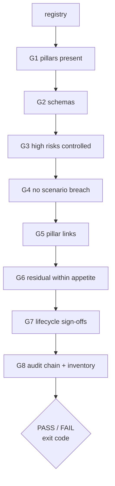

# Component: CI gate

One command decides whether the registry is fit to merge: `modelrisk gate`. It fails if any pillar is
missing or invalid, a high or critical risk has no implemented control, a scenario breaches, a pillar
link is broken, residual risk exceeds appetite, a lifecycle stage lacks valid sign-offs, the audit chain
is broken or the inventory disagrees with the registry.

Sections: [1. Purpose](#1-purpose) · [2. Architecture](#2-architecture) · [3. How it works](#3-how-it-works) · [4. Key files](#4-key-files) · [5. Code excerpts](#5-code-excerpts) · [6. Configuration](#6-configuration) · [7. Commands](#7-commands) · [8. Real output](#8-real-output) · [9. Tests and gates](#9-tests-and-gates) · [10. Guardrails](#10-guardrails) · [11. Security and governance](#11-security-and-governance) · [12. Observability](#12-observability) · [13. Failure modes](#13-failure-modes) · [14. Mapping to Azure services](#14-mapping-to-azure-services) · [15. Limitations](#15-limitations) · [16. Interview talking points](#16-interview-talking-points)

## 1. Purpose

* Turn the governance rules into a merge check.

## 2. Architecture



## 3. How it works

1. `run_gate` loads every model and runs `check_model` (G1 to G7), then G8 globally.
2. G1 and G2 short-circuit: an incomplete model is not scored.
3. Exit code 1 on any failure; `--json` prints the full report for evidence.
4. CI runs it after pytest; the deploy workflow uploads the JSON report to the evidence registry.

## 4. Key files

| File | Role |
|---|---|
| `src/modelrisk/gate.py` | Checks |
| `.github/workflows/ci.yml` | Runs the gate |
| `tests/test_gate.py` | One failing case per check |

## 5. Code excerpts

<!-- code: src/modelrisk/gate.py::check_model -->
```python
def check_model(rec: ModelRecord, now: int | None = None) -> dict[str, Any]:
    out: list[dict[str, Any]] = []

    def add(gid: str, ok: bool, detail: str) -> None:
        out.append({"gate": gid, "ok": bool(ok), "detail": detail})

    miss = rec.missing_pillars()
    add("G1-pillars", not miss, "missing: " + ",".join(miss) if miss else "4/4")
    errs = [f"{k}: {e}" for k, kind in ARTIFACTS.items() if getattr(rec, k) is not None for e in errors(kind, getattr(rec, k))]
    add("G2-schemas", not errs, "; ".join(errs[:3]) or "valid")
    if miss or errs:
        return {"model": rec.id, "ok": False, "checks": out}
    bare = [r["id"] for r in rec.risks() if score_risk(r)["inherent"] >= 10 and not score_risk(r)["implemented_controls"]]
    add("G3-high-risk-controls", not bare, "no implemented control: " + ",".join(bare) if bare else "every high/critical risk controlled")
    res = scenario_results(rec)
    br = [f"{r['id']} {r['metric']}={r['value']}" for r in res if r["status"] == "breach"]
    add("G4-scenarios", not br, "breach: " + "; ".join(br) if br else f"{len(res)} scenarios, {sum(r['status'] == 'warn' for r in res)} warn")
    links = (
        [x for x in risk_coverage(rec) if not x["ok"]]
        + [x for x in understanding_checks(rec) if not x["ok"]]
        + [x for x in scenario_links(rec) if not x["ok"]]
    )
    add("G5-pillar-links", not links, "; ".join(str(x.get("id") or x.get("kind") or x.get("risk")) for x in links) or "all links hold")
    over = [r["id"] for r in update_residuals(rec, res) if not r["within_appetite"]]
    add("G6-appetite", not over, "over appetite: " + ",".join(over) if over else f"within tier {tier(rec.model_card)} appetite")
    st = stage_status(rec, [r["status"] for r in res], validation_outcome(rec.id), now)
    failed = [f"{c['stage']}: {c['check']}" for c in st["checks"] if not c["ok"]]
    add("G7-lifecycle", st["ok"], "; ".join(failed) or f"stage {rec.stage} gates pass")
    return {"model": rec.id, "ok": all(c["ok"] for c in out), "checks": out, "next_blockers": st["next_blockers"]}
```
<!-- /code -->

<!-- code: src/modelrisk/gate.py::run_gate -->
```python
def run_gate(now: int | None = None) -> dict[str, Any]:
    recs = load_all()
    models = [check_model(r, now) for r in recs]
    chain = verify_chain()
    inv_ids = [m["id"] for m in inventory()["models"]]
    folders = sorted(p.name for p in REGISTRY.iterdir() if p.is_dir())
    inv_ok = not errors("inventory", inventory()) and len(set(inv_ids)) == len(inv_ids) and sorted(inv_ids) == folders
    global_checks = [
        {"gate": "G8-audit-chain", "ok": chain["ok"], "detail": str(chain)},
        {"gate": "G8-inventory", "ok": inv_ok, "detail": f"{len(inv_ids)} models, {len(folders)} folders"},
    ]
    ok = all(m["ok"] for m in models) and all(c["ok"] for c in global_checks)
    return {
        "ok": ok,
        "models": models,
        "global": global_checks,
        "tiers": {r.id: {"tier": tier(r.model_card), "eu_ai_act": eu_ai_act_class(r.model_card)} for r in recs},
    }
```
<!-- /code -->

## 6. Configuration

No configuration: thresholds live in the pillars and in `scoring.APPETITE`.

## 7. Commands

```bash
modelrisk gate
modelrisk gate --json > evidence/gate-report.json
```

## 8. Real output

<!-- output: gate -->
```text
model                               G1  G2  G3  G4  G5  G6  G7
----------------------------------  --  --  --  --  --  --  --
halcyon-fraud-triage                ok  ok  ok  ok  ok  ok  ok
bramblewood-claims-triage           ok  ok  ok  ok  ok  ok  ok
cedarhollow-underwriting-assistant  ok  ok  ok  ok  ok  ok  ok
juniper-prior-auth                  ok  ok  ok  ok  ok  ok  ok
marigold-pricing-demand             ok  ok  ok  ok  ok  ok  ok
pfa-mortgage-flow                   ok  ok  ok  ok  ok  ok  ok
pfs-safety-layer                    ok  ok  ok  ok  ok  ok  ok
pal-agent-labs                      ok  ok  ok  ok  ok  ok  ok
pfb-fabric-data-agent               ok  ok  ok  ok  ok  ok  ok
pff-finops-agent                    ok  ok  ok  ok  ok  ok  ok
G8-audit-chain: ok
G8-inventory: ok
gate: PASS
```
<!-- /output -->

## 9. Tests and gates

* `tests/test_gate.py` deletes a pillar, breaks a schema, removes controls, forces a breach, breaks a link,
  raises residual, stales a sign-off and tampers with the audit log, and checks each fails.

## 10. Guardrails

* The gate cannot be configured to skip a check.

## 11. Security and governance

The gate report is the evidence a reviewer asks for at merge and at release.

## 12. Observability

`modelrisk.gate` events per model.

## 13. Failure modes

| Failure | Handling |
|---|---|
| Flaky scenario | deterministic seeds; none are flaky |
| Slow gate | scenario results are memoised per content |

## 14. Mapping to Azure services

* **GitHub Actions** required status check; **Azure Policy** as the runtime counterpart; gate JSON in the
  **evidence storage account**; **Application Insights** for gate events; **Foundry evaluations** as
  scenario evidence for hosted models.

## 15. Limitations

* The gate trusts external scenario attestations for portfolio components.

## 16. Interview talking points

* "Eight checks, each with a test that makes it fail."
