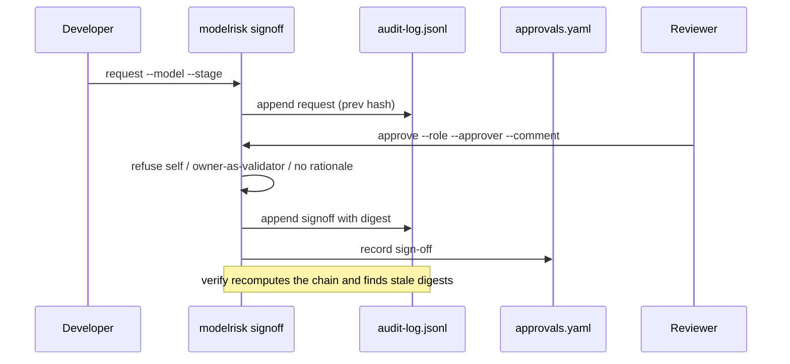

# Component: HITL sign-off and audit log

People approve stage transitions. Each sign-off records role, approver, decision, comment and the
digest of the four pillars, and is appended to a hash-chained audit log. The flow refuses self sign-off,
an owner acting as validator and empty rationales.

Sections: [1. Purpose](#1-purpose) · [2. Architecture](#2-architecture) · [3. How it works](#3-how-it-works) · [4. Key files](#4-key-files) · [5. Code excerpts](#5-code-excerpts) · [6. Configuration](#6-configuration) · [7. Commands](#7-commands) · [8. Real output](#8-real-output) · [9. Tests and gates](#9-tests-and-gates) · [10. Guardrails](#10-guardrails) · [11. Security and governance](#11-security-and-governance) · [12. Observability](#12-observability) · [13. Failure modes](#13-failure-modes) · [14. Mapping to Azure services](#14-mapping-to-azure-services) · [15. Limitations](#15-limitations) · [16. Interview talking points](#16-interview-talking-points)

## 1. Purpose

* Human accountability with tamper evidence.

## 2. Architecture



## 3. How it works

1. `digest(rec)` hashes the parsed pillars canonically.
2. `request` appends a request event. `sign` validates the approver and writes the sign-off.
3. Every log entry has `prev` and `hash` (SHA-256 of the entry with the previous hash).
4. `verify_chain` recomputes the chain; `stale_signoffs` lists approvals whose digest no longer matches.
5. `valid_signoffs` ignores stale and expired approvals; lifecycle gates use only valid ones.

## 4. Key files

| File | Role |
|---|---|
| `src/modelrisk/signoff.py` | Digest, sign, chain |
| `registry/audit-log.jsonl` | The log |
| `registry/*/approvals.yaml` | Current sign-offs |
| `scripts/seed_signoffs.py` | Seeds the demo sign-offs |

## 5. Code excerpts

<!-- code: src/modelrisk/signoff.py::digest -->
```python
def digest(rec: ModelRecord) -> str:
    """sha256 over the parsed content of the four pillars (comments and layout do not count)."""
    body = {p: getattr(rec, p) for p in PILLARS}
    return hashlib.sha256(canonical(body).encode()).hexdigest()
```
<!-- /code -->

<!-- code: src/modelrisk/signoff.py::verify_chain -->
```python
def verify_chain(path: Path = AUDIT_LOG) -> dict[str, Any]:
    prev = GENESIS
    for i, e in enumerate(read_log(path), 1):
        body = {k: v for k, v in e.items() if k != "hash"}
        if e["prev"] != prev or e["seq"] != i:
            return {"ok": False, "broken_at": i, "reason": "sequence or previous-hash mismatch"}
        if hashlib.sha256((prev + canonical(body)).encode()).hexdigest() != e["hash"]:
            return {"ok": False, "broken_at": i, "reason": "entry hash mismatch"}
        prev = e["hash"]
    return {"ok": True, "entries": len(read_log(path))}
```
<!-- /code -->

## 6. Configuration

`MAX_AGE_DAYS = 365`; approver names are fictional.

## 7. Commands

```bash
modelrisk signoff verify
modelrisk signoff request --model juniper-prior-auth --stage production --by "Clinical AI Engineering team"
modelrisk signoff approve --model juniper-prior-auth --stage production --role compliance --approver "Priya Natarajan" --comment "Reviewed PHI masking evidence and HC-S1 results"
python scripts/seed_signoffs.py   # regenerate the demo log after pillar edits
```

## 8. Real output

<!-- output: signoff verify -->
```text
audit chain: {'ok': True, 'entries': 62}
stale sign-offs: none
```
<!-- /output -->

## 9. Tests and gates

* `tests/test_signoff.py`: refusals, digest change, expiry, chain tamper detection, valid sign-offs.

## 10. Guardrails

* The approve command is for people; the MCP server cannot call it.

## 11. Security and governance

Audit log entries hold ids and digests, never personal data beyond fictional names.

## 12. Observability

`modelrisk.signoff` events.

## 13. Failure modes

| Failure | Caught by |
|---|---|
| Log edited | chain verification, G8 |
| Approval reused after edits | digest mismatch |

## 14. Mapping to Azure services

* **Azure Storage immutable blob (WORM) policy** for the log in the evidence container; **Entra ID** for
  approver identity; **Purview** audit; **Application Insights** sign-off events; **Azure Policy** to enforce immutability.

## 15. Limitations

* Names are strings, not authenticated identities.

## 16. Interview talking points

* "Approvals are bound to a digest, so editing a card after approval invalidates it."
