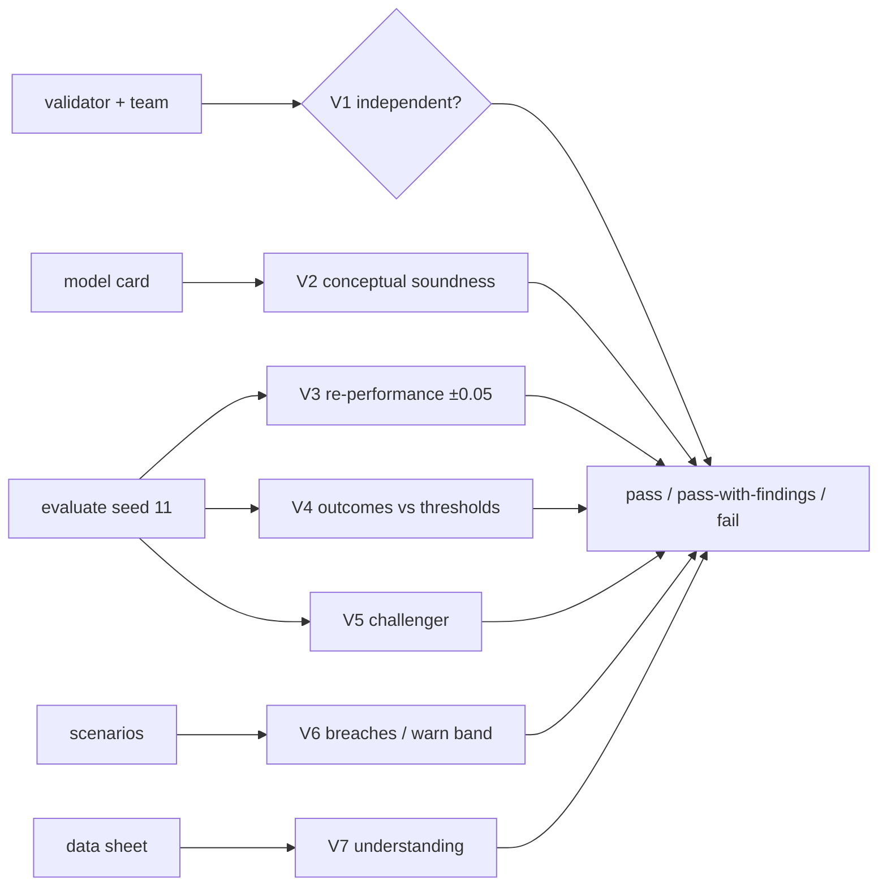

# Component: independent validation

A validator outside the developer team re-performs the model's claims on a different seed, checks
conceptual soundness, compares with a naive challenger, checks data understanding and reviews scenario
results. The outcome is pass, pass-with-findings or fail.

Sections: [1. Purpose](#1-purpose) · [2. Architecture](#2-architecture) · [3. How it works](#3-how-it-works) · [4. Key files](#4-key-files) · [5. Code excerpts](#5-code-excerpts) · [6. Configuration](#6-configuration) · [7. Commands](#7-commands) · [8. Real output](#8-real-output) · [9. Tests and gates](#9-tests-and-gates) · [10. Guardrails](#10-guardrails) · [11. Security and governance](#11-security-and-governance) · [12. Observability](#12-observability) · [13. Failure modes](#13-failure-modes) · [14. Mapping to Azure services](#14-mapping-to-azure-services) · [15. Limitations](#15-limitations) · [16. Interview talking points](#16-interview-talking-points)

## 1. Purpose

* Effective challenge in the SR 11-7 sense, in code.

## 2. Architecture



## 3. How it works

1. V1 refuses validators from the developer team or the owner.
2. V2 requires limitations, out-of-scope uses and a fallback.
3. V3 re-runs `evaluate` on seed 11 and compares each card metric within 0.05.
4. V4 checks fresh metrics against thresholds. V5 balanced accuracy beats 0.5.
5. V7 runs data-sheet understanding checks. V6 reviews scenarios; warn-band items are low findings.
6. Any high-severity finding fails; medium or low findings give pass-with-findings.

## 4. Key files

| File | Role |
|---|---|
| `src/modelrisk/validation.py` | Findings V1-V7 |
| `src/modelrisk/evaluation.py` | Re-performance |
| `src/modelrisk/gate.py` | validation_outcome feeds G7 |

## 5. Code excerpts

<!-- code: src/modelrisk/validation.py::validate -->
```python
def validate(rec: ModelRecord, validator: str, team: str = "Independent Validation") -> dict[str, Any]:
    card = rec.model_card
    f: list[dict[str, Any]] = []
    indep = team.lower() not in card["developer"].lower() and validator.lower() not in card["owner"].lower()
    f.append(_finding("V1-independence", indep, "high", f"{validator} ({team}) vs developer {card['developer']}"))
    concept = bool(card["limitations"]) and bool(card["out_of_scope_uses"]) and bool(card["system"]["fallback"])
    f.append(_finding("V2-conceptual-soundness", concept, "medium", "limitations, out-of-scope uses and fallback documented"))
    if rec.kind == "domain":
        spec = SPECS[rec.id]
        fresh = _eval(rec.id, VALIDATION_SEED)
        gaps = [f"{m['name']} card {m['value']} vs {fresh[m['name']]}" for m in card["metrics"] if abs(m["value"] - fresh[m["name"]]) > TOLERANCE]
        f.append(_finding("V3-re-performance", not gaps, "high", "; ".join(gaps) or f"all card metrics reproduce on seed {VALIDATION_SEED}"))
        below = [
            f"{m['name']} {fresh[m['name']]} < {m['threshold']}"
            for m in card["metrics"]
            if (fresh[m["name"]] < m["threshold"] if m["direction"] == "higher-is-better" else fresh[m["name"]] > m["threshold"])
        ]
        f.append(_finding("V4-outcomes", not below, "high", "; ".join(below) or "all metrics meet thresholds on fresh data"))
        bal = round((fresh["recall"] + _specificity(spec)) / 2, 4)
        f.append(_finding("V5-challenger", bal > 0.5, "medium", f"balanced accuracy {bal} vs naive challenger 0.5"))
        dsc = [c["id"] for c in understanding_checks(rec) if not c["ok"]]
        f.append(_finding("V7-data-understanding", not dsc, "high", ",".join(dsc) or "all data-sheet checks pass"))
    else:
        f.append(_finding("V3-re-performance", True, "low", "re-performed in the source repository's CI (attested)"))
    res = scenario_results(rec)
    breaches = [r["id"] for r in res if r["status"] == "breach"]
    warns = [r["id"] for r in res if r["status"] == "warn"]
    f.append(_finding("V6-scenarios", not breaches, "high", f"breaches {breaches}" if breaches else f"{len(res)} scenarios, warn {warns}"))
    if warns:
        f.append(_finding("V6-warn-band", False, "low", f"inside warn band: {warns}"))
    high = [x for x in f if x["severity"] == "high"]
    other = [x for x in f if x["severity"] in ("medium", "low")]
    outcome = "fail" if high else "pass-with-findings" if other else "pass"
    return {"model": rec.id, "validator": validator, "team": team, "outcome": outcome, "findings": f}
```
<!-- /code -->

## 6. Configuration

Seed 11 (`VALIDATION_SEED`), tolerance 0.05 (`TOLERANCE`), default validator Iris Delgado (fictional).

## 7. Commands

```bash
modelrisk validate --model juniper-prior-auth
modelrisk validate --model cedarhollow-underwriting-assistant
modelrisk validate --model pfa-mortgage-flow
```

## 8. Real output

<!-- output: validate --model juniper-prior-auth -->
```text
validation of juniper-prior-auth by Iris Delgado (Independent Validation): pass-with-findings
id                       ok       severity  detail
-----------------------  -------  --------  -------------------------------------------------------------------------------
V1-independence          ok       none      Iris Delgado (Independent Validation) vs developer Clinical AI Engineering team
V2-conceptual-soundness  ok       none      limitations, out-of-scope uses and fallback documented
V3-re-performance        ok       none      all card metrics reproduce on seed 11
V4-outcomes              ok       none      all metrics meet thresholds on fresh data
V5-challenger            ok       none      balanced accuracy 0.689 vs naive challenger 0.5
V7-data-understanding    ok       none      all data-sheet checks pass
V6-scenarios             ok       none      8 scenarios, warn ['HC-S7']
V6-warn-band             finding  low       inside warn band: ['HC-S7']
```
<!-- /output -->

<!-- output: validate --model cedarhollow-underwriting-assistant -->
```text
validation of cedarhollow-underwriting-assistant by Iris Delgado (Independent Validation): pass
id                       ok  severity  detail
-----------------------  --  --------  ------------------------------------------------------------------
V1-independence          ok  none      Iris Delgado (Independent Validation) vs developer Lending AI team
V2-conceptual-soundness  ok  none      limitations, out-of-scope uses and fallback documented
V3-re-performance        ok  none      all card metrics reproduce on seed 11
V4-outcomes              ok  none      all metrics meet thresholds on fresh data
V5-challenger            ok  none      balanced accuracy 0.7353 vs naive challenger 0.5
V7-data-understanding    ok  none      all data-sheet checks pass
V6-scenarios             ok  none      8 scenarios, warn []
```
<!-- /output -->

<!-- output: validate --model pfa-mortgage-flow -->
```text
validation of pfa-mortgage-flow by Iris Delgado (Independent Validation): pass
id                       ok  severity  detail
-----------------------  --  --------  --------------------------------------------------------------------------------------------
V1-independence          ok  none      Iris Delgado (Independent Validation) vs developer Jagadish-azure-agent-platform maintainers
V2-conceptual-soundness  ok  none      limitations, out-of-scope uses and fallback documented
V3-re-performance        ok  none      re-performed in the source repository's CI (attested)
V6-scenarios             ok  none      1 scenarios, warn []
```
<!-- /output -->

## 9. Tests and gates

* Tests cover dependence refusal, inflated metrics failing V3, warn-band findings and the external path.

## 10. Guardrails

* The validator never edits pillars; findings become backlog work for the developer.

## 11. Security and governance

SR 11-7 independence; NIST AI RMF MEASURE; ISO/IEC 42001 performance evaluation.

## 12. Observability

Validation outcome is part of the gate report uploaded as evidence.

## 13. Failure modes

| Failure | Caught by |
|---|---|
| Developer validates own model | V1 |
| Card metrics copied from an old run | V3 |

## 14. Mapping to Azure services

* **Foundry evaluations** run on a held-out dataset as the re-performance step; **Azure ML** jobs for
  challenger models; **Purview** to confirm validation data lineage; results in **Application Insights**.

## 15. Limitations

* Portfolio components are attested, not re-performed here.

## 16. Interview talking points

* "Validation re-performs every number on the card with a different seed."
