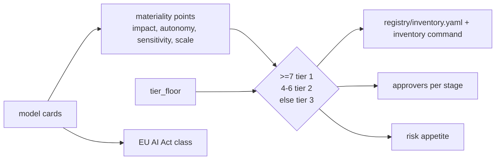

# Component: model inventory and risk tiering

The inventory lists every model with its domain, stage, tier and EU AI Act class. Tiers come from
materiality points computed from the model card, so they cannot be set by hand except upwards through a
documented tier floor.

Sections: [1. Purpose](#1-purpose) · [2. Architecture](#2-architecture) · [3. How it works](#3-how-it-works) · [4. Key files](#4-key-files) · [5. Code excerpts](#5-code-excerpts) · [6. Configuration](#6-configuration) · [7. Commands](#7-commands) · [8. Real output](#8-real-output) · [9. Tests and gates](#9-tests-and-gates) · [10. Guardrails](#10-guardrails) · [11. Security and governance](#11-security-and-governance) · [12. Observability](#12-observability) · [13. Failure modes](#13-failure-modes) · [14. Mapping to Azure services](#14-mapping-to-azure-services) · [15. Limitations](#15-limitations) · [16. Interview talking points](#16-interview-talking-points)

## 1. Purpose

* One list of models that every other component reads.
* Proportionate governance: tier sets approvers, appetite and validation depth.

## 2. Architecture



## 3. How it works

1. `registry/inventory.yaml` lists models and their folders; `load_all` reads the four pillars and approvals.
2. `materiality` adds points; `tier` applies thresholds and the floor.
3. `eu_ai_act_class` reads declared uses.
4. Tier feeds `REQUIRED_ROLES` (lifecycle) and `APPETITE` (scoring).
5. Gate G8 checks the inventory matches the registry folders.

## 4. Key files

| File | Role |
|---|---|
| `registry/inventory.yaml` | The list |
| `schemas/inventory.schema.json` | Its schema |
| `src/modelrisk/registry.py` | Loading |
| `src/modelrisk/tiering.py` | Points, tier, EU class |

## 5. Code excerpts

<!-- code: src/modelrisk/tiering.py::tier -->
```python
def tier(card: dict[str, Any]) -> int:
    score = sum(materiality(card).values())
    computed = 1 if score >= 7 else 2 if score >= 4 else 3
    floor = card.get("regulatory", {}).get("tier_floor", 3)
    return min(computed, floor)
```
<!-- /code -->

<!-- code: src/modelrisk/registry.py::ModelRecord -->
```python
@dataclass
class ModelRecord:
    id: str
    stage: str
    folder: Path
    model_card: dict[str, Any] | None
    data_sheet: dict[str, Any] | None
    risk_cards: dict[str, Any] | None
    scenarios: dict[str, Any] | None
    approvals: dict[str, Any] | None

    @property
    def kind(self) -> str:
        return (self.model_card or {}).get("kind", "domain")

    def missing_pillars(self) -> list[str]:
        return [p for p in PILLARS if getattr(self, p) is None]

    def risks(self) -> list[dict[str, Any]]:
        return (self.risk_cards or {}).get("risks", [])

    def scenario_list(self) -> list[dict[str, Any]]:
        return (self.scenarios or {}).get("scenarios", [])
```
<!-- /code -->

## 6. Configuration

| Points | Tier | Production approvers |
|---|---|---|
| 7 or more | 1 | validator, model risk, business owner, compliance |
| 4 to 6 | 2 | validator, model risk, business owner |
| 0 to 3 | 3 | validator, business owner |

`pfb-fabric-data-agent` scores 1 point but has `tier_floor: 2` because it answers questions over
enterprise finance data.

## 7. Commands

```bash
modelrisk inventory
modelrisk model pfb-fabric-data-agent
```

## 8. Real output

<!-- output: inventory -->
```text
model                               domain           stage        tier  points  EU AI Act
----------------------------------  ---------------  -----------  ----  ------  ---------
halcyon-fraud-triage                banking          monitoring   1     11      minimal
bramblewood-claims-triage           insurance        production   1     9       minimal
cedarhollow-underwriting-assistant  mortgage         validation   1     9       high-risk
juniper-prior-auth                  healthcare       validation   1     10      high-risk
marigold-pricing-demand             retail           monitoring   2     5       minimal
pfa-mortgage-flow                   mortgage         production   1     9       high-risk
pfs-safety-layer                    platform-safety  production   2     5       minimal
pal-agent-labs                      research         development  3     0       minimal
pfb-fabric-data-agent               analytics        production   2     1       minimal
pff-finops-agent                    finops           production   3     3       minimal
```
<!-- /output -->

## 9. Tests and gates

* `tests/test_scoring_tiering.py` pins all ten tiers and EU classes, floor behaviour and thresholds.
* Gate G8-inventory.

## 10. Guardrails

* A floor can only raise a tier. Tiers are recomputed on every run, never stored as truth.

## 11. Security and governance

The inventory is the regulator-facing list (SR 11-7 expects a complete inventory; ISO/IEC 42001 expects
a defined scope of AI systems).

## 12. Observability

`modelrisk.gate` events carry the tier; the workbook groups by it.

## 13. Failure modes

| Failure | Caught by |
|---|---|
| Model folder not in inventory | G8 |
| Card understates autonomy | review; `required_risks` asks for matching risks |

## 14. Mapping to Azure services

* **Azure Policy** `allowed-risk-tier` restricts the `risk-tier` tag to 1, 2 or 3 and
  `require-model-card-tags` makes the tags mandatory.
* **Purview** can hold the inventory as a business glossary; **Foundry** projects list deployments to reconcile.
* **Application Insights** for gate events by tier.

## 15. Limitations

* Points are a simple additive scheme; real programmes add expert override with rationale.

## 16. Interview talking points

* "Tier is computed, and the only manual lever is a documented floor that raises it."
* "Fraud is tier 1 but EU minimal; healthcare is tier 1 and high-risk. Different questions."
