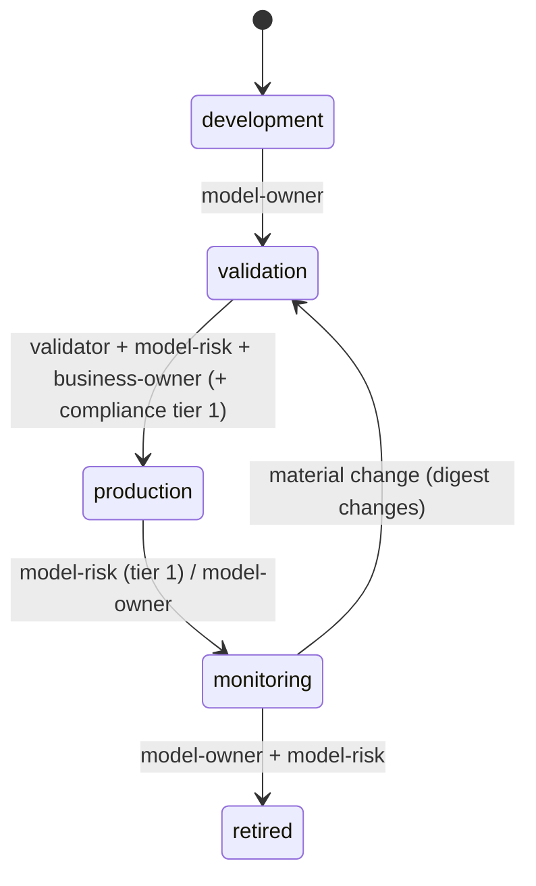

# Component: lifecycle and approval gates

Models move through development, validation, production, monitoring and retirement. Entry to each
stage needs named roles to approve the current pillar digest, plus evidence: validation outcome, no
scenario breaches, and for PHI models extra privacy and clinical sign-offs.

Sections: [1. Purpose](#1-purpose) · [2. Architecture](#2-architecture) · [3. How it works](#3-how-it-works) · [4. Key files](#4-key-files) · [5. Code excerpts](#5-code-excerpts) · [6. Configuration](#6-configuration) · [7. Commands](#7-commands) · [8. Real output](#8-real-output) · [9. Tests and gates](#9-tests-and-gates) · [10. Guardrails](#10-guardrails) · [11. Security and governance](#11-security-and-governance) · [12. Observability](#12-observability) · [13. Failure modes](#13-failure-modes) · [14. Mapping to Azure services](#14-mapping-to-azure-services) · [15. Limitations](#15-limitations) · [16. Interview talking points](#16-interview-talking-points)

## 1. Purpose

* Make promotion a checked state change, not an email.
* Show what blocks the next stage.

## 2. Architecture



## 3. How it works

1. `approvals.yaml` holds the stage and the sign-offs.
2. `required_roles(rec, stage)` = tier roles + extras (privacy and clinical reviewer for PHI).
3. `gate_checks` per stage: sign-offs valid on the current digest and unexpired, validation not failed,
   no scenario breaches for production.
4. `stage_status` checks the current and all earlier stages, and lists next-stage blockers.
5. Gate G7 fails if the current stage's checks fail.

## 4. Key files

| File | Role |
|---|---|
| `src/modelrisk/lifecycle.py` | Stages, roles, checks |
| `registry/*/approvals.yaml` | Stage and sign-offs |
| `schemas/approvals.schema.json` | Schema |

## 5. Code excerpts

<!-- code: src/modelrisk/lifecycle.py::REQUIRED_ROLES -->
```python
REQUIRED_ROLES: dict[str, dict[int, list[str]]] = {
    "validation": {1: ["model-owner"], 2: ["model-owner"], 3: ["model-owner"]},
    "production": {
        1: ["validator", "model-risk", "business-owner", "compliance"],
        2: ["validator", "model-risk", "business-owner"],
        3: ["validator", "business-owner"],
    },
    "monitoring": {1: ["model-risk"], 2: ["model-owner"], 3: ["model-owner"]},
    "retired": {1: ["model-owner", "model-risk"], 2: ["model-owner", "model-risk"], 3: ["model-owner"]},
}
```
<!-- /code -->

<!-- code: src/modelrisk/lifecycle.py::extra_roles -->
```python
def extra_roles(rec: ModelRecord, stage: str) -> list[str]:
    """Domain-specific approvers on top of the tier defaults."""
    if stage != "production" or rec.kind != "domain":
        return []
    roles = []
    if "phi" in rec.model_card["data_sensitivity"]:
        roles += ["privacy", "clinical-reviewer"]
    return roles
```
<!-- /code -->

## 6. Configuration

Sign-offs expire after 365 days (`MAX_AGE_DAYS`) and must match the current digest.

## 7. Commands

```bash
modelrisk lifecycle
modelrisk gate --json | python -m json.tool | head -40
```

## 8. Real output

<!-- output: lifecycle -->
```text
model                               stage        tier  current gates  next stage  next-stage blockers
----------------------------------  -----------  ----  -------------  ----------  -----------------------------
halcyon-fraud-triage                monitoring   1     pass           -           -
bramblewood-claims-triage           production   1     pass           monitoring  model-risk
cedarhollow-underwriting-assistant  validation   1     pass           production  compliance
juniper-prior-auth                  validation   1     pass           production  compliance, clinical-reviewer
marigold-pricing-demand             monitoring   2     pass           -           -
pfa-mortgage-flow                   production   1     pass           monitoring  model-risk
pfs-safety-layer                    production   2     pass           monitoring  model-owner
pal-agent-labs                      development  3     pass           validation  model-owner
pfb-fabric-data-agent               production   2     pass           monitoring  model-owner
pff-finops-agent                    production   3     pass           monitoring  model-owner
```
<!-- /output -->

## 9. Tests and gates

* `tests/test_lifecycle_validation_monitoring.py`: missing roles, stale digest, expiry, PHI extras, blockers.
* G7 in `tests/test_gate.py`.

## 10. Guardrails

* Mortgage and healthcare are held in validation by missing sign-offs; the gate passes because their
  *current* stage is satisfied, and the blockers are reported.

## 11. Security and governance

Maps to SR 11-7 governance, NIST AI RMF GOVERN, ISO/IEC 42001 operational planning and control.

## 12. Observability

`modelrisk.signoff` events per sign-off.

## 13. Failure modes

| Failure | Caught by |
|---|---|
| Pillar edited after approval | digest mismatch, G7 |
| Approval older than a year | expiry |
| Missing compliance sign-off | next-stage blocker |

## 14. Mapping to Azure services

* **Azure DevOps / GitHub environments** with required reviewers mirror the gates in deployment.
* **Foundry** model registry stages; **Purview** for data approvals; **Azure Policy** for deployment
  conditions; **Application Insights** for sign-off events.

## 15. Limitations

* Sign-offs live in the repository; a production system would use an approval service with identity.

## 16. Interview talking points

* "Promotion is a function of signed evidence on the current digest."
* "The lifecycle command tells you exactly who still has to sign."
