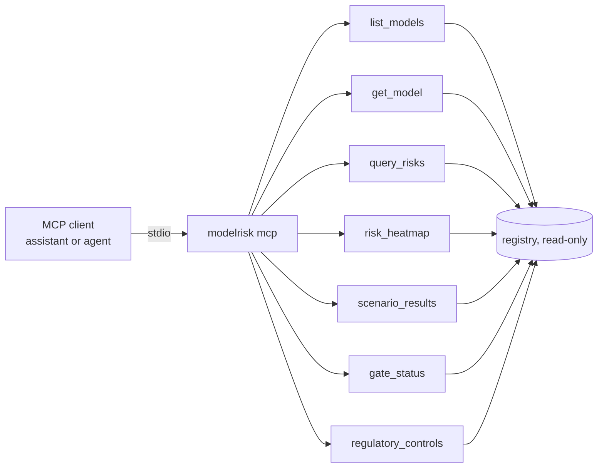

# Component: MCP server for the risk register

A read-only Model Context Protocol server exposes the register to agents and assistants: list models,
get a model, query risks by band or category, the heatmap, scenario results, gate status and regulatory
controls. Every tool is annotated read-only and idempotent.

Sections: [1. Purpose](#1-purpose) · [2. Architecture](#2-architecture) · [3. How it works](#3-how-it-works) · [4. Key files](#4-key-files) · [5. Code excerpts](#5-code-excerpts) · [6. Configuration](#6-configuration) · [7. Commands](#7-commands) · [8. Real output](#8-real-output) · [9. Tests and gates](#9-tests-and-gates) · [10. Guardrails](#10-guardrails) · [11. Security and governance](#11-security-and-governance) · [12. Observability](#12-observability) · [13. Failure modes](#13-failure-modes) · [14. Mapping to Azure services](#14-mapping-to-azure-services) · [15. Limitations](#15-limitations) · [16. Interview talking points](#16-interview-talking-points)

## 1. Purpose

* Let people ask "what critical risks are open in mortgage?" from an assistant, without write access.

## 2. Architecture



## 3. How it works

1. `build_server` registers seven tools with `ToolAnnotations(readOnlyHint=True, destructiveHint=False)`.
2. `query` filters risks by model, minimum band and category, returning residual and owners.
3. `modelrisk mcp` serves over stdio; `modelrisk mcp-demo` calls the tools in-process.

## 4. Key files

| File | Role |
|---|---|
| `src/modelrisk/mcp_server.py` | Server and tools |
| `tests/test_mcp_cli.py` | Tool tests |

## 5. Code excerpts

<!-- code: src/modelrisk/mcp_server.py::query -->
```python
def query(model_id: str | None = None, min_band: str = "low", category: str | None = None, owner: str | None = None) -> list[dict[str, Any]]:
    rows = []
    for r in load_all():
        if model_id and r.id != model_id:
            continue
        for risk in r.risks():
            s = score_risk(risk)
            if BAND_ORDER.index(s["inherent_band"]) < BAND_ORDER.index(min_band):
                continue
            if category and risk["category"] != category:
                continue
            if owner and owner.lower() not in risk["owner"].lower():
                continue
            rows.append({"model": r.id, **s})
    return sorted(rows, key=lambda x: (-x["inherent"], x["id"]))
```
<!-- /code -->

<!-- code: src/modelrisk/mcp_server.py::TOOL_NAMES -->
```python
TOOL_NAMES = ["list_models", "get_model", "query_risks", "risk_heatmap", "scenario_results", "gate_status", "regulatory_controls"]
```
<!-- /code -->

## 6. Configuration

Client configuration example:

```json
{"mcpServers": {"model-risk": {"command": "modelrisk", "args": ["mcp"]}}}
```

## 7. Commands

```bash
modelrisk mcp-demo
modelrisk mcp
```

## 8. Real output

<!-- output: mcp-demo -->
```text
tools: gate_status, get_model, list_models, query_risks, regulatory_controls, risk_heatmap, scenario_results
all read-only: True
critical inherent risks: 3
  juniper-prior-auth                   HC-R1    inherent 20 -> residual 1.8
  cedarhollow-underwriting-assistant   MTG-R1   inherent 20 -> residual 1.6
  halcyon-fraud-triage                 BNK-R1   inherent 16 -> residual 3.36
  MTG-S1 adverse_impact_ratio = 0.955 (pass)
  MTG-S2 decision_flip_rate = 0.0 (pass)
nist-ai-rmf items: GOVERN 1, GOVERN 2, GOVERN 6, MAP 1, MAP 2, MAP 4, MAP 5, MEASURE 1, MEASURE 2, MEASURE 3, MANAGE 1, MANAGE 2, MANAGE 4
```
<!-- /output -->

## 9. Tests and gates

* Tests list tools, check every tool is read-only, and call each one.

## 10. Guardrails

* No write tools; sign-offs are a separate, human-only CLI path.

## 11. Security and governance

Read access to the register is still sensitive; a hosted version needs Entra ID auth.

## 12. Observability

A hosted version would log tool calls to Application Insights.

## 13. Failure modes

| Failure | Behaviour |
|---|---|
| Unknown model | error result, no exception to the client |

## 14. Mapping to Azure services

* Host as an **Azure Container App** or **Azure Functions** MCP endpoint behind **API Management**;
  register in **Foundry** as a tool; **Application Insights** for calls; **Azure Policy** for private networking.

## 15. Limitations

* stdio only in this repository.

## 16. Interview talking points

* "The register is queryable by agents, read-only by construction."
