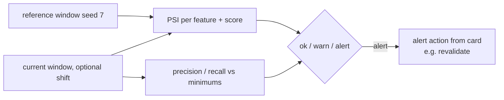

# Component: ongoing monitoring

Monitoring compares a production-like window with the reference data: PSI per input and on scores,
plus performance against minimums from the model card. Warn and alert levels come from the card;
an alert triggers the card's alert action (revalidation).

Sections: [1. Purpose](#1-purpose) · [2. Architecture](#2-architecture) · [3. How it works](#3-how-it-works) · [4. Key files](#4-key-files) · [5. Code excerpts](#5-code-excerpts) · [6. Configuration](#6-configuration) · [7. Commands](#7-commands) · [8. Real output](#8-real-output) · [9. Tests and gates](#9-tests-and-gates) · [10. Guardrails](#10-guardrails) · [11. Security and governance](#11-security-and-governance) · [12. Observability](#12-observability) · [13. Failure modes](#13-failure-modes) · [14. Mapping to Azure services](#14-mapping-to-azure-services) · [15. Limitations](#15-limitations) · [16. Interview talking points](#16-interview-talking-points)

## 1. Purpose

* Detect drift and performance decay between validations.

## 2. Architecture



## 3. How it works

1. `monitor(rec, seed, shift)` evaluates a window (default seed 101) and the reference.
2. PSI per documented feature and on scores; levels from the card (`psi_warn`, `psi_alert`).
3. Performance metrics against card minimums, with a warn band.
4. The worst level wins; alerts name the action.

## 4. Key files

| File | Role |
|---|---|
| `src/modelrisk/monitoring.py` | monitor |
| `src/modelrisk/scenarios/engine.py` | psi |
| `registry/*/model-card.yaml` | monitoring thresholds |

## 5. Code excerpts

<!-- code: src/modelrisk/monitoring.py::monitor -->
```python
def monitor(rec: ModelRecord, seed: int = 101, shift: float = 0.0) -> dict[str, Any]:
    if rec.kind != "domain":
        return {"model": rec.id, "status": "external", "checks": [], "action": "monitored in the source repository"}
    cfg = rec.model_card["monitoring"]
    spec = SPECS[rec.id]
    ref = evaluate(spec, seed=7)
    cur = evaluate(spec, n=cfg["window"], seed=seed, shift=shift)
    checks = []
    for f in spec.features:
        v = psi(ref["features"][f], cur["features"][f])
        checks.append({"check": f"psi:{f}", "value": v, "status": _psi_status(v, cfg["psi_warn"], cfg["psi_alert"])})
    v = psi(ref["scores"], cur["scores"])
    checks.append({"check": "psi:score", "value": v, "status": _psi_status(v, cfg["psi_warn"], cfg["psi_alert"])})
    for p in cfg["performance"]:
        val = cur[p["metric"]]
        st = "alert" if val < p["min"] else "warn" if val < p["warn"] else "ok"
        checks.append({"check": f"perf:{p['metric']}", "value": val, "status": st, "min": p["min"], "warn": p["warn"]})
    overall = max((c["status"] for c in checks), key=LEVEL.get)
    action = {"ok": "none", "warn": "watch next window; P2 backlog item", "alert": cfg["on_alert"]}[overall]
    return {"model": rec.id, "window": cfg["window"], "seed": seed, "shift": shift, "status": overall, "checks": checks, "action": action}
```
<!-- /code -->

## 6. Configuration

| Card field | Example |
|---|---|
| `window` | 500 |
| `psi_warn` / `psi_alert` | 0.1 / 0.25 |
| `performance_min` | per metric |
| `alert_action` | revalidate |

## 7. Commands

```bash
modelrisk monitor --model juniper-prior-auth
modelrisk monitor --model halcyon-fraud-triage --shift 0.3
```

## 8. Real output

<!-- output: monitor --model juniper-prior-auth -->
```text
monitoring window for juniper-prior-auth: 500 cases, shift 0.0 -> WARN
check                   value   status
----------------------  ------  ------
psi:conservative_weeks  0.0151  ok
psi:red_flags           0.0087  ok
psi:days_since_imaging  0.0219  ok
psi:doc_score           0.0206  ok
psi:score               0.0137  ok
perf:precision          0.8385  warn
action: watch next window; P2 backlog item
```
<!-- /output -->

<!-- output: monitor --model halcyon-fraud-triage --shift 0.3 -->
```text
monitoring window for halcyon-fraud-triage: 500 cases, shift 0.3 -> ALERT
check                value   status
-------------------  ------  ------
psi:amount           0.2755  alert
psi:velocity_1h      0.2392  warn
psi:geo_mismatch     0.014   ok
psi:device_age_days  0.4985  alert
psi:mcc_risk         0.0162  ok
psi:score            0.4433  alert
perf:accuracy        0.628   alert
action: Route every case to a human, open a revalidation item and notify the model owner.
```
<!-- /output -->

## 9. Tests and gates

* Tests: normal windows do not alert; shift 0.3 alerts in all five domains; healthcare precision sits in warn.

## 10. Guardrails

* Alerts route to revalidation, not automatic retraining.

## 11. Security and governance

SR 11-7 ongoing monitoring; NIST AI RMF MEASURE 2 and MANAGE 4; EU AI Act post-market monitoring for high-risk systems.

## 12. Observability

`modelrisk.drift` events; workbook drift panel; an optional scheduled query alert in the IaC.

## 13. Failure modes

| Failure | Mitigation |
|---|---|
| Labels delayed | PSI still alerts |
| Seasonal shifts | reference window choice |

## 14. Mapping to Azure services

* **Azure ML model monitoring** / **Foundry continuous evaluation**; **Application Insights** alerts
  (scheduled query rule in the IaC, off by default); **Purview** lineage; **Azure Policy** diagnostic settings.

## 15. Limitations

* Windows are synthetic; no seasonality.

## 16. Interview talking points

* "Healthcare precision is in the warn band on a normal window, and I show it rather than tune it away."
