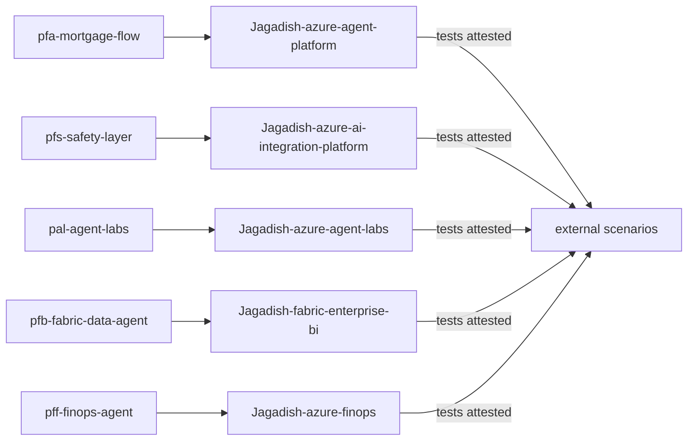

# Component: portfolio cross-link

Five model cards govern components of the other repositories in this portfolio: the mortgage flow in
the agent platform, the safety layer in the integration platform, the agent labs, the Fabric data agent
and the FinOps agent. Their scenarios are external: they cite the source repository's tests.

Sections: [1. Purpose](#1-purpose) · [2. Architecture](#2-architecture) · [3. How it works](#3-how-it-works) · [4. Key files](#4-key-files) · [5. Code excerpts](#5-code-excerpts) · [6. Configuration](#6-configuration) · [7. Commands](#7-commands) · [8. Real output](#8-real-output) · [9. Tests and gates](#9-tests-and-gates) · [10. Guardrails](#10-guardrails) · [11. Security and governance](#11-security-and-governance) · [12. Observability](#12-observability) · [13. Failure modes](#13-failure-modes) · [14. Mapping to Azure services](#14-mapping-to-azure-services) · [15. Limitations](#15-limitations) · [16. Interview talking points](#16-interview-talking-points)

## 1. Purpose

* Apply the same governance to real code elsewhere in the portfolio.

## 2. Architecture



## 3. How it works

1. Each portfolio card has `governs`, a link into the other repository.
2. External scenarios record the repo and test files; `run_external` returns the attested result.
3. `portfolio --verify` re-runs those tests when a sibling checkout and its environment exist.

## 4. Key files

| File | Role |
|---|---|
| `registry/pf*/` | Portfolio cards |
| `registry/pal-agent-labs/` | Agent labs card |
| `src/modelrisk/scenarios/engine.py` | run_external |

## 5. Code excerpts

<!-- code: src/modelrisk/scenarios/engine.py::run_external -->
```python
def run_external(scenario: dict[str, Any]) -> dict[str, Any]:
    """Portfolio components are tested in their own repositories. The value is the attested
    result of that suite (1 = passing); ``modelrisk portfolio --verify`` re-runs it when the
    sibling checkout is present."""
    p = scenario["params"]
    value = int(p.get("attested_passing", 0))
    return {
        "id": scenario["id"],
        "kind": "external",
        "metric": scenario["metric"],
        "value": value,
        "threshold": f"{scenario['threshold']['op']} {scenario['threshold']['value']}",
        "status": status(value, scenario["threshold"], scenario.get("warn")),
        "mitigations": "on",
        "risk_ids": scenario["risk_ids"],
        "details": {"repo": p["repo"], "tests": p["tests"], "evidence": scenario.get("evidence", "")},
    }
```
<!-- /code -->

## 6. Configuration

`params.repo`, `params.tests`, `params.attested_passing`.

## 7. Commands

```bash
modelrisk portfolio
modelrisk portfolio --verify   # needs sibling checkouts with their own environments
```

## 8. Real output

<!-- output: portfolio -->
```text
model                  tier  stage        risks  scenarios    governs
---------------------  ----  -----------  -----  -----------  ------------------------------------------------------------------
pfa-mortgage-flow      1     production   3      PFA-X1 pass  Jagadish-azure-agent-platform/tree/main/src/agentplatform/mortgage
pfs-safety-layer       2     production   2      PFS-X1 pass  Jagadish-azure-ai-integration-platform/tree/main/src/aiip/safety
pal-agent-labs         3     development  2      PAL-X1 pass  Jagadish-azure-agent-labs/tree/main/labs
pfb-fabric-data-agent  2     production   2      PFB-X1 pass  Jagadish-fabric-enterprise-bi/tree/main/src/fabricbi/serve
pff-finops-agent       3     production   2      PFF-X1 pass  Jagadish-azure-finops/tree/main/src/finops/agent
```
<!-- /output -->

## 9. Tests and gates

* Tests check every portfolio card has `governs`, an external scenario and a valid tier.

## 10. Guardrails

* Attestations are explicit and labelled as such in validation (V3 low).

## 11. Security and governance

The mortgage flow is high-risk (creditworthiness) and tier 1, governed like the domain agent.

## 12. Observability

Gate events include portfolio models.

## 13. Failure modes

| Failure | Mitigation |
|---|---|
| Source repo tests fail later | `--verify` in a scheduled job |

## 14. Mapping to Azure services

* **Foundry** projects per component; **Azure Policy** tags across their resource groups; **Purview**
  for shared data; **Application Insights** across components.

## 15. Limitations

* External results are attested, not re-run in CI here.

## 16. Interview talking points

* "The same card format governs code in five other repositories."
