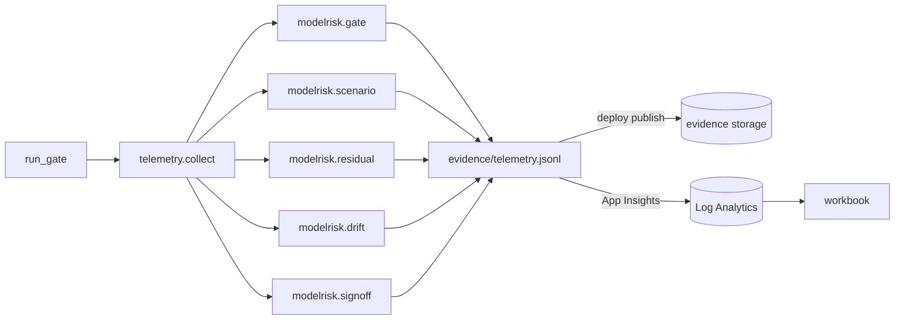

# Component: telemetry and evidence

Governance results become events: gate, scenario, residual, drift and sign-off. The deploy workflow
would publish them with the gate report to the evidence storage account; the workbook reads them from
Log Analytics.

Sections: [1. Purpose](#1-purpose) · [2. Architecture](#2-architecture) · [3. How it works](#3-how-it-works) · [4. Key files](#4-key-files) · [5. Code excerpts](#5-code-excerpts) · [6. Configuration](#6-configuration) · [7. Commands](#7-commands) · [8. Real output](#8-real-output) · [9. Tests and gates](#9-tests-and-gates) · [10. Guardrails](#10-guardrails) · [11. Security and governance](#11-security-and-governance) · [12. Observability](#12-observability) · [13. Failure modes](#13-failure-modes) · [14. Mapping to Azure services](#14-mapping-to-azure-services) · [15. Limitations](#15-limitations) · [16. Interview talking points](#16-interview-talking-points)

## 1. Purpose

* One event schema for governance signals.

## 2. Architecture



## 3. How it works

1. `collect(gate)` takes the gate report and builds events with model, ids, statuses and values (no text).
2. `modelrisk telemetry --out FILE` writes JSON lines; without `--out` it prints counts.
3. `deploy.sh publish` uploads the gate report and events with Entra auth.

## 4. Key files

| File | Role |
|---|---|
| `src/modelrisk/telemetry.py` | Events |
| `.github/scripts/deploy.sh` | publish |
| `infra/workbook/model-risk-workbook.json` | Queries |

## 5. Code excerpts

<!-- code: src/modelrisk/telemetry.py::collect -->
```python
def collect(gate: dict[str, Any] | None = None) -> list[dict[str, Any]]:
    out: list[dict[str, Any]] = []
    if gate:
        for m in gate["models"]:
            out.append(event("modelrisk.gate", model=m["model"], ok=m["ok"],
                             failed=",".join(c["gate"] for c in m["checks"] if not c["ok"])))
    for rec in load_all():
        res = scenario_results(rec)
        for r in res:
            out.append(event("modelrisk.scenario", model=rec.id, scenario=r["id"], kind=r["kind"], status=r["status"],
                             value=r["value"], threshold=r["threshold"]))
        for r in update_residuals(rec, res):
            out.append(event("modelrisk.residual", model=rec.id, risk=r["id"], residual=r["residual"],
                             band=r["residual_band"], within_appetite=r["within_appetite"]))
        if rec.kind == "domain":
            m = monitor(rec)
            psi = next(c["value"] for c in m["checks"] if c["check"] == "psi:score")
            out.append(event("modelrisk.drift", model=rec.id, psi_score=psi, status=m["status"]))
    for e in read_log():
        if e["event"] == "signoff":
            out.append(event("modelrisk.signoff", model=e["model_id"], stage=e["stage"], role=e["role"], decision=e["decision"]))
    return out
```
<!-- /code -->

## 6. Configuration

Event names are fixed; dimensions are model, id, status, value.

## 7. Commands

```bash
modelrisk telemetry
modelrisk telemetry --out evidence/telemetry.jsonl
```

## 8. Real output

<!-- output: telemetry -->
```text
modelrisk.drift      5
modelrisk.gate       10
modelrisk.residual   48
modelrisk.scenario   43
modelrisk.signoff    41
147 events
```
<!-- /output -->

## 9. Tests and gates

* Tests check event names, counts and that no free text is emitted.

## 10. Guardrails

* No PII or PHI in events.

## 11. Security and governance

Evidence storage is versioned and keyless.

## 12. Observability

This component is the observability layer.

## 13. Failure modes

| Failure | Mitigation |
|---|---|
| Upload fails | deploy job fails; evidence stays in the run artifact |

## 14. Mapping to Azure services

* **Application Insights** custom events, **Log Analytics** workbook, **Storage** evidence container,
  **Azure Policy** for diagnostic settings, **Purview** to catalogue the evidence store.

## 15. Limitations

* Events are written to a file here; nothing is sent.

## 16. Interview talking points

* "Every governance result is an event, so the workbook and the audit read the same data."
