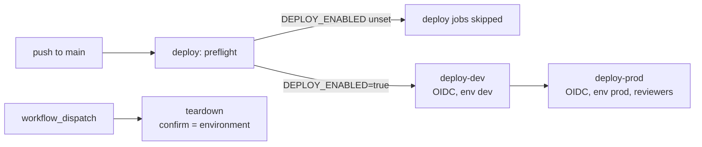

# Deployment

Nothing in this repository is deployed. The workflows exist so the path is reviewable.

## Gate

`deploy.yml` and `teardown.yml` run deploy jobs only when the repository variable `DEPLOY_ENABLED` is
`true`. The `preflight` job always runs and writes the gate state to the job summary.

## One-time setup

1. Entra app registration with federated credentials for `repo:<owner>/<repo>:environment:dev` and
   `:environment:prod`. No client secret.
2. Role assignments: Contributor plus Resource Policy Contributor on the target scope.
3. GitHub variables: `AZURE_CLIENT_ID`, `AZURE_TENANT_ID`, `AZURE_SUBSCRIPTION_ID`, optional
   `AZURE_LOCATION`, `DEPLOY_TOOL`.
4. GitHub environments `dev` and `prod`; `prod` with required reviewers.
5. Terraform state account (Terraform path only).

## What a deploy does

`.github/scripts/deploy.sh` runs:

* `provision`: Terraform apply with the environment tfvars, or `az deployment sub create` for Bicep.
* `smoke`: checks the resource group, workspace, storage and policy assignments exist.
* `publish`: runs `modelrisk gate --json` and `modelrisk telemetry`, uploads both to the evidence
  container with `--auth-mode login`.
* `destroy`: used by teardown.

## Cost

Smallest settings: LRS storage, PerGB2018 workspace with 30-day retention and a 0.5 GB daily cap,
workspace-based Application Insights, drift alert off in dev. Policy definitions and assignments are free.
