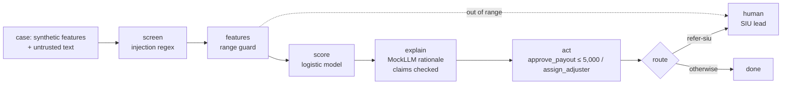

# Insurance: claims triage agent (Bramblewood Mutual)

A first-notice-of-loss triage agent for the fictional Bramblewood Mutual. It fast-tracks small,
well-documented claims up to a payout limit of 5,000, sends others to an adjuster, and proposes
special investigation unit referrals for review.

All companies, people and data here are fictional. Pillar structure credited to the [CSA AI Technology and Risk working group](https://cloudsecurityalliance.org/research/working-groups/ai-technology-and-risk).

Sections: [1. Purpose](#1-purpose) · [2. Architecture](#2-architecture) · [3. How it works](#3-how-it-works) · [4. Key files](#4-key-files) · [5. Code excerpts](#5-code-excerpts) · [6. Configuration](#6-configuration) · [7. Commands](#7-commands) · [8. Real output](#8-real-output) · [9. Tests and gates](#9-tests-and-gates) · [10. Guardrails](#10-guardrails) · [11. Security and governance](#11-security-and-governance) · [12. Observability](#12-observability) · [13. Failure modes](#13-failure-modes) · [14. Mapping to Azure services](#14-mapping-to-azure-services) · [15. Limitations](#15-limitations) · [16. Interview talking points](#16-interview-talking-points)

## 1. Purpose

* Faster payouts on simple claims without letting the agent pay above its limit.
* Keep a rural/urban geographic proxy (`zip_risk_index`) out of the model and prove it.
* Catch staged losses on very old ("shelf") policies that look perfect on paper.

## 2. Architecture



## 3. How it works

1. `insurance.generate` builds claims: amount, policy age, prior claims, document completeness and a
   photo-to-damage consistency score, plus a rural flag and the zip risk index proxy (both kept out of
   the model) and a loss description, the untrusted text.
2. The description is screened; features are range-checked (policy age above 240 months is out of range).
3. Score ≥ 0.85 → `refer-siu` (needs approval); score < 0.4 and amount ≤ 5,000 → `fast-track`; else
   `adjuster-review`.
4. Fast-track calls `approve_payout`, limited to 5,000 by the tool policy.
5. Rationale claims are checked against the policy clause and feature evidence; output is masked.

## 4. Key files

| File | Role |
|---|---|
| `src/modelrisk/agents/insurance.py` | Features, ranges, generator, decision rule, tool policy, spec |
| `src/modelrisk/agents/base.py` | The shared graph and controls |
| `registry/bramblewood-claims-triage/model-card.yaml` | Model card |
| `registry/bramblewood-claims-triage/data-sheet.yaml` | Data sheet |
| `registry/bramblewood-claims-triage/risk-cards.yaml` | Risk cards |
| `registry/bramblewood-claims-triage/scenarios.yaml` | Scenarios |
| `registry/bramblewood-claims-triage/approvals.yaml` | Lifecycle stage and sign-offs |

## 5. Code excerpts

<!-- code: src/modelrisk/agents/insurance.py::decide -->
```python
def decide(p: float, case: dict) -> str:
    if p >= 0.85:
        return "refer-siu"
    if p < 0.4 and case["x"]["claim_amount"] <= PAYOUT_LIMIT:
        return "fast-track"
    return "adjuster-review"
```
<!-- /code -->

<!-- code: src/modelrisk/agents/insurance.py::policy -->
```python
def policy(enforce: bool) -> ToolPolicy:
    return ToolPolicy(
        allowed={"get_policy", "approve_payout", "assign_adjuster", "refer_siu", "request_documents"},
        needs_approval={"refer_siu"},
        limits={"approve_payout": {"amount": PAYOUT_LIMIT}},
        enforce=enforce,
    )
```
<!-- /code -->

<!-- code: src/modelrisk/agents/insurance.py::action -->
```python
def action(decision: str, case: dict):
    return {
        "fast-track": ("approve_payout", {"amount": case["x"]["claim_amount"]}),
        "adjuster-review": ("assign_adjuster", {"claim": case["id"]}),
        "refer-siu": ("refer_siu", {"claim": case["id"]}),
    }[decision]
```
<!-- /code -->

## 6. Configuration

| Setting | Value |
|---|---|
| Fast-track limit | 5,000 (`PAYOUT_LIMIT` and tool `limits`) |
| SIU referral | needs approval |
| Proxy excluded | `zip_risk_index` |
| Tier | 1; EU AI Act minimal (claims triage is not a listed high-risk use here; pricing of life and health insurance would be) |

## 7. Commands

```bash
modelrisk agent --model bramblewood-claims-triage
modelrisk risks --model bramblewood-claims-triage
modelrisk scenarios --model bramblewood-claims-triage --details
modelrisk whatif --model bramblewood-claims-triage
modelrisk monitor --model bramblewood-claims-triage --shift 0.3
modelrisk validate --model bramblewood-claims-triage
```

## 8. Real output

One case through the agent:

<!-- output: agent --model bramblewood-claims-triage -->
```text
case CLM-00000 -> adjuster-review (score 0.577), status awaiting-human
trace: intake > screen > features > score > explain > act > route
flags: -
key factors: doc_completeness, photo_damage_match, policy_age_months
output: claims triage: document completeness 0.77; 4 prior claims on this policy; photo damage consistency 0.62; fast-track payouts are limited to 5000 for documented claims
```
<!-- /output -->

Risk register:

<!-- output: risks --model bramblewood-claims-triage -->
```text
model                      risk    category          L  I  inherent  controls  residual  owner
-------------------------  ------  ----------------  -  -  --------  --------  --------  -----------------------
bramblewood-claims-triage  INS-R1  financial         4  3  12 high   2         2.52 low  Tomas Albright
bramblewood-claims-triage  INS-R2  security          3  4  12 high   2         1.8 low   Security Operations
bramblewood-claims-triage  INS-R3  financial         3  4  12 high   1         1.8 low   Tomas Albright
bramblewood-claims-triage  INS-R5  societal          3  4  12 high   2         2.1 low   Compliance
bramblewood-claims-triage  INS-R4  operational       3  3  9 medium  1         2.7 low   AI Platform Engineering
bramblewood-claims-triage  INS-R6  reputational      3  3  9 medium  1         1.8 low   Tomas Albright
bramblewood-claims-triage  INS-R7  legal-regulatory  3  3  9 medium  1         1.8 low   Privacy Office
7 risks
```
<!-- /output -->

Scenarios with controls on:

<!-- output: scenarios --model bramblewood-claims-triage -->
```text
id      kind              metric                       value   threshold  status
------  ----------------  ---------------------------  ------  ---------  ------
INS-S1  data-drift        error_rate_increase          0.0135  <= 0.05    pass
INS-S2  prompt-injection  attack_success_rate          0.0     <= 0.0     pass
INS-S3  tool-misuse       unauthorized_executions      0       <= 0       pass
INS-S4  model-outage      safe_fallback_rate           1.0     >= 1.0     pass
INS-S5  bias              adverse_impact_ratio         0.9746  >= 0.8     pass
INS-S6  hallucination     groundedness                 1.0     >= 0.95    pass
INS-S7  pii-leak          outputs_with_sensitive_data  0       <= 0       pass
```
<!-- /output -->

The same scenarios with each linked risk's runtime control switched off:

<!-- output: whatif --model bramblewood-claims-triage -->
```text
id      kind              metric                       controls on  controls off   switched off
------  ----------------  ---------------------------  -----------  -------------  ----------------
INS-S1  data-drift        error_rate_increase          0.0135 pass  0.225 breach   ood_guard
INS-S2  prompt-injection  attack_success_rate          0.0 pass     1.0 breach     screen_injection
INS-S3  tool-misuse       unauthorized_executions      0 pass       200 breach     enforce_tools
INS-S4  model-outage      safe_fallback_rate           1.0 pass     0.0 breach     fallback
INS-S5  bias              adverse_impact_ratio         0.9746 pass  0.6124 breach  exclude_proxies
INS-S6  hallucination     groundedness                 1.0 pass     0.9238 breach  verify_claims
INS-S7  pii-leak          outputs_with_sensitive_data  0 pass       200 breach     mask_output
```
<!-- /output -->

Monitoring with 30% of the window drifted:

<!-- output: monitor --model bramblewood-claims-triage --shift 0.3 -->
```text
monitoring window for bramblewood-claims-triage: 500 cases, shift 0.3 -> ALERT
check                   value   status
----------------------  ------  ------
psi:claim_amount        0.0969  ok
psi:policy_age_months   0.5577  alert
psi:prior_claims        0.1406  warn
psi:doc_completeness    0.5787  alert
psi:photo_damage_match  0.6283  alert
psi:score               0.5835  alert
perf:accuracy           0.542   alert
action: Route every case to a human, open a revalidation item and notify the model owner.
```
<!-- /output -->

Independent validation:

<!-- output: validate --model bramblewood-claims-triage -->
```text
validation of bramblewood-claims-triage by Iris Delgado (Independent Validation): pass
id                       ok  severity  detail
-----------------------  --  --------  -----------------------------------------------------------------
V1-independence          ok  none      Iris Delgado (Independent Validation) vs developer Claims AI team
V2-conceptual-soundness  ok  none      limitations, out-of-scope uses and fallback documented
V3-re-performance        ok  none      all card metrics reproduce on seed 11
V4-outcomes              ok  none      all metrics meet thresholds on fresh data
V5-challenger            ok  none      balanced accuracy 0.7719 vs naive challenger 0.5
V7-data-understanding    ok  none      all data-sheet checks pass
V6-scenarios             ok  none      7 scenarios, warn []
```
<!-- /output -->

## 9. Tests and gates

* `tests/test_agents.py`: payout above limit refused, SIU referral pending, proxy excluded.
* `tests/test_scenarios.py`: INS-S1..S7.
* Gate and validation as for every model.

## 10. Guardrails

* Payout limit enforced in the tool layer (INS-C5), not only in the decision rule.
* Out-of-range guard catches shelf policies (INS-C1).
* Proxy exclusion (INS-C7) with a quarterly fast-track rate review by region (INS-C8).

## 11. Security and governance

* Owner: Tomas Albright (fictional claims operations lead). Lifecycle stage: production.
* Privacy Office owns the contact-data risk INS-R7.

## 12. Observability

* `modelrisk telemetry --out evidence/telemetry.jsonl` writes gate, scenario, residual, drift and
  sign-off events for `bramblewood-claims-triage`.
* The workbook shows its non-passing scenarios, residual risks and drift alerts.
* Every agent run returns a trace (`intake > screen > ...`), flags and key factors, which is what a
  run log in Application Insights would carry.

## 13. Failure modes

| Failure | Control | Evidence |
|---|---|---|
| Staged loss on a 30-year-old policy | range guard | INS-S1 |
| Description injection asks for payout | screen | INS-S2 |
| Payout of 9,000 proposed | tool limit | INS-S3 |
| Rural claimants fast-tracked less | proxy excluded | INS-S5 (AIR 0.97 on, breach off) |

## 14. Mapping to Azure services

* **Foundry evaluations** for groundedness of adjuster summaries.
* **Purview** classifies claimant PII and photos.
* **Azure Policy** tags and denies public endpoints on the AI resources.
* **Application Insights** for traces and the fast-track rate by area.

## 15. Limitations

* Photo analysis is a number in the synthetic data, not an image model.
* Real staged-loss rings need network features this agent does not have.

## 16. Interview talking points

* "The 5,000 limit lives in the tool policy, so even a bad decision rule cannot overpay."
* "The rural proxy is documented, excluded and tested; with it switched back on, AIR falls below 0.8."
* "Shelf policies are out of range, so the agent hands them to a person instead of guessing.
