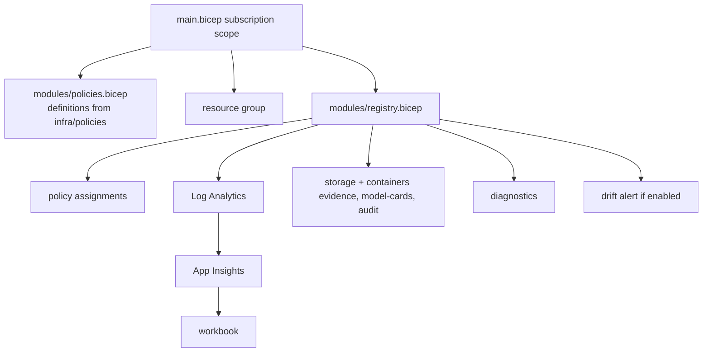

# Infrastructure: Bicep stack

The Bicep stack is the second, equivalent path: subscription-scope `main.bicep` creates the resource group and policy definitions, and the `registry` module adds assignments, Log Analytics, Application Insights, the workbook, evidence storage, diagnostics and the optional drift alert.

**Nothing is deployed.** Every deploy path is gated by the repository variable `DEPLOY_ENABLED`, which is not set.

Sections: [1. Purpose](#1-purpose) · [2. Architecture](#2-architecture) · [3. How it works](#3-how-it-works) · [4. Key files](#4-key-files) · [5. Code excerpts](#5-code-excerpts) · [6. Configuration](#6-configuration) · [7. Commands](#7-commands) · [8. Real output](#8-real-output) · [9. Tests and gates](#9-tests-and-gates) · [10. Guardrails](#10-guardrails) · [11. Security and governance](#11-security-and-governance) · [12. Observability](#12-observability) · [13. Failure modes](#13-failure-modes) · [14. Mapping to Azure services](#14-mapping-to-azure-services) · [15. Limitations](#15-limitations) · [16. Interview talking points](#16-interview-talking-points)

## 1. Purpose

* Offer a native Azure path with the same resources and the same policy and workbook JSON as Terraform.

## 2. Architecture



## 3. How it works

1. `policies.bicep` reads the JSON files with `loadJsonContent`.
2. `registry.bicep` assigns them with the chosen effect and builds the evidence plane.
3. `main.parameters.json` holds dev-style defaults (Audit, alert off).
4. `az bicep build` runs in CI with warnings treated seriously.

## 4. Key files

| File | Role |
|---|---|
| `infra/bicep/main.bicep` | Subscription entry point |
| `infra/bicep/modules/policies.bicep` | Definitions |
| `infra/bicep/modules/registry.bicep` | Assignments and evidence plane |
| `infra/bicep/main.parameters.json` | Parameters |

## 5. Code excerpts

<!-- code: infra/bicep/modules/registry.bicep::resource evidence -->
```bicep
resource evidence 'Microsoft.Storage/storageAccounts@2023-05-01' = {
  name: 'stmodelrisk${environment}${region}001'
  location: location
  kind: 'StorageV2'
  sku: { name: 'Standard_LRS' }
  tags: tags
  properties: {
    minimumTlsVersion: 'TLS1_2'
    allowSharedKeyAccess: false
    allowBlobPublicAccess: false
    supportsHttpsTrafficOnly: true
  }
}
```
<!-- /code -->

<!-- code: infra/bicep/modules/registry.bicep::resource appi -->
```bicep
resource appi 'Microsoft.Insights/components@2020-02-02' = {
  name: 'appi-modelrisk-${suffix}'
  location: location
  kind: 'other'
  tags: tags
  properties: {
    Application_Type: 'other'
    WorkspaceResourceId: law.id
    DisableLocalAuth: true
  }
}
```
<!-- /code -->

## 6. Configuration

| Parameter | Default |
|---|---|
| `environment` | dev |
| `policyEffect` | Audit |
| `logRetentionDays` | 30 |
| `deployDriftAlert` | false |

## 7. Commands

```bash
az bicep build --file infra/bicep/main.bicep --stdout > /dev/null
az deployment sub what-if --location eastus2 --template-file infra/bicep/main.bicep \
  --parameters infra/bicep/main.parameters.json   # only with credentials; the workflow does this when enabled
```

## 8. Real output

<!-- output: iac --part bicep -->
```text
main.bicep               rg             Microsoft.Resources/resourceGroups
main.bicep               policies       (module)
main.bicep               registry       (module)
modules/policies.bicep   definitions    Microsoft.Authorization/policyDefinitions
modules/registry.bicep   assignments    Microsoft.Authorization/policyAssignments
modules/registry.bicep   law            Microsoft.OperationalInsights/workspaces
modules/registry.bicep   appi           Microsoft.Insights/components
modules/registry.bicep   workbook       Microsoft.Insights/workbooks
modules/registry.bicep   evidence       Microsoft.Storage/storageAccounts
modules/registry.bicep   blob           Microsoft.Storage/storageAccounts/blobServices
modules/registry.bicep   containers     Microsoft.Storage/storageAccounts/blobServices/containers
modules/registry.bicep   blobDiag       Microsoft.Insights/diagnosticSettings
modules/registry.bicep   actionGroup    Microsoft.Insights/actionGroups
modules/registry.bicep   driftAlert     Microsoft.Insights/scheduledQueryRules
```
<!-- /output -->

## 9. Tests and gates

* `ci.yml` bicep job builds the template.
* `tests/test_iac.py` checks keyless storage, versioning, local auth off and parameter defaults.

## 10. Guardrails

* Same as Terraform: no shared keys, local auth off, versioning.

## 11. Security and governance

Deployment via OIDC in the gated workflow only.

## 12. Observability

Same workspace and workbook as Terraform.

## 13. Failure modes

| Failure | Handling |
|---|---|
| Preview API version changes | pinned API versions per resource |

## 14. Mapping to Azure services

* **Azure Policy**: the three custom definitions are the runtime guardrail for model resources.
* **Application Insights + Log Analytics**: telemetry events and the workbook.
* **Storage (evidence registry)**: gate reports, telemetry, model cards and the audit log.
* **Foundry evaluations** results and **Purview** scans would land in the same evidence container and
  workspace; Purview would register the storage account as a data source.

## 15. Limitations

* No what-if in CI without credentials.

## 16. Interview talking points

* "Two IaC tools, one set of policy JSON files; the deploy workflow picks either with an input."
