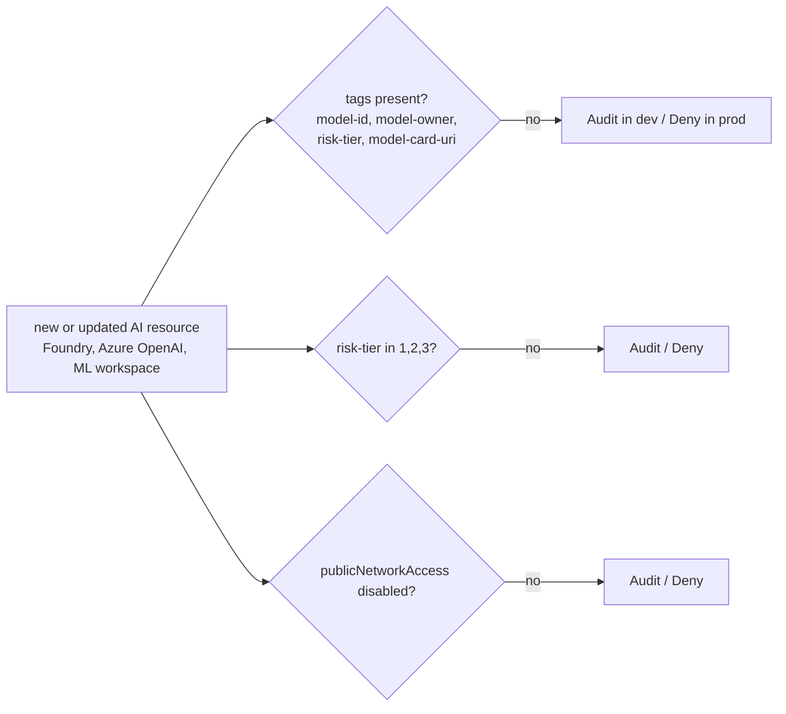

# Infrastructure: Azure Policy definitions

Three custom policy definitions turn model governance into resource rules: model-card tags are required on AI resources, the risk-tier tag must be 1, 2 or 3, and AI endpoints must not allow public network access.

**Nothing is deployed.** Every deploy path is gated by the repository variable `DEPLOY_ENABLED`, which is not set.

Sections: [1. Purpose](#1-purpose) · [2. Architecture](#2-architecture) · [3. How it works](#3-how-it-works) · [4. Key files](#4-key-files) · [5. Code excerpts](#5-code-excerpts) · [6. Configuration](#6-configuration) · [7. Commands](#7-commands) · [8. Real output](#8-real-output) · [9. Tests and gates](#9-tests-and-gates) · [10. Guardrails](#10-guardrails) · [11. Security and governance](#11-security-and-governance) · [12. Observability](#12-observability) · [13. Failure modes](#13-failure-modes) · [14. Mapping to Azure services](#14-mapping-to-azure-services) · [15. Limitations](#15-limitations) · [16. Interview talking points](#16-interview-talking-points)

## 1. Purpose

* Make it impossible (in prod) to create an AI resource that is not linked to a model card and a tier.

## 2. Architecture



## 3. How it works

1. Each JSON file is a full definition (mode Indexed, parameters, rule with `[parameters('effect')]`).
2. Both IaC stacks load the files unchanged.
3. Assignment effect comes from the environment: Audit in dev, Deny in prod.

## 4. Key files

| File | Role |
|---|---|
| `infra/policies/require-model-card-tags.json` | Required tags |
| `infra/policies/allowed-risk-tier.json` | Tier values |
| `infra/policies/deny-public-ai-endpoints.json` | Network |

## 5. Code excerpts

<!-- code: infra/policies/require-model-card-tags.json -->
```json
{
  "displayName": "Model risk: require model-card tags on AI resources",
  "description": "AI resources (Foundry and Azure OpenAI accounts, Machine Learning workspaces and endpoints, or anything tagged workload-type=ai-model) must carry model-id, model-owner, risk-tier and model-card-uri, so every deployed model can be traced to its card in the inventory.",
  "mode": "Indexed",
  "metadata": { "category": "AI model governance" },
  "parameters": {
    "tagNames": {
      "type": "Array",
      "metadata": { "displayName": "Required model-card tags" },
      "defaultValue": ["model-id", "model-owner", "risk-tier", "model-card-uri"]
    },
    "aiResourceTypes": {
      "type": "Array",
      "metadata": { "displayName": "Resource types treated as AI models" },
      "defaultValue": [
        "Microsoft.CognitiveServices/accounts",
        "Microsoft.MachineLearningServices/workspaces",
        "Microsoft.MachineLearningServices/workspaces/onlineEndpoints"
      ]
    },
    "effect": {
      "type": "String",
      "allowedValues": ["Audit", "Deny", "Disabled"],
      "defaultValue": "Deny"
    }
  },
  "policyRule": {
    "if": {
      "allOf": [
        {
          "anyOf": [
            { "field": "type", "in": "[parameters('aiResourceTypes')]" },
            { "field": "tags['workload-type']", "equals": "ai-model" }
          ]
        },
        {
          "count": {
            "value": "[parameters('tagNames')]",
            "name": "tagName",
            "where": { "field": "[concat('tags[', current('tagName'), ']')]", "exists": "false" }
          },
          "greater": 0
        }
      ]
    },
    "then": { "effect": "[parameters('effect')]" }
  }
}
```
<!-- /code -->

## 6. Configuration

Parameters: `effect` (Audit, Deny, Disabled), `tagNames`, `aiResourceTypes`, `allowedTiers`.

## 7. Commands

```bash
modelrisk iac --part policies
python -m json.tool infra/policies/allowed-risk-tier.json
```

## 8. Real output

<!-- output: iac --part policies -->
```text
allowed-risk-tier          mode=Indexed  default=Deny tiers=1,2,3
deny-public-ai-endpoints   mode=Indexed  default=Deny
require-model-card-tags    mode=Indexed  default=Deny tags=model-id,model-owner,risk-tier,model-card-uri
assigned effect in dev: Audit
assigned effect in prod: Deny
```
<!-- /output -->

## 9. Tests and gates

* `tests/test_iac.py`: shape, defaults, tiers equal to lifecycle tiers, both stacks load them.

## 10. Guardrails

* Deny in prod; Audit in dev to avoid blocking experiments while still reporting.

## 11. Security and governance

Policy compliance is evidence for ISO/IEC 42001 operational control and NIST AI RMF GOVERN.

## 12. Observability

Compliance state appears in Azure Policy and can be exported to Log Analytics.

## 13. Failure modes

| Failure | Handling |
|---|---|
| Resource type not listed | parameter `aiResourceTypes` extended |

## 14. Mapping to Azure services

* **Azure Policy**: the three custom definitions are the runtime guardrail for model resources.
* **Application Insights + Log Analytics**: telemetry events and the workbook.
* **Storage (evidence registry)**: gate reports, telemetry, model cards and the audit log.
* **Foundry evaluations** results and **Purview** scans would land in the same evidence container and
  workspace; Purview would register the storage account as a data source.

## 15. Limitations

* Tags prove linkage, not quality; quality is the gate's job.

## 16. Interview talking points

* "Policy enforces that every AI resource points to its model card and tier."
