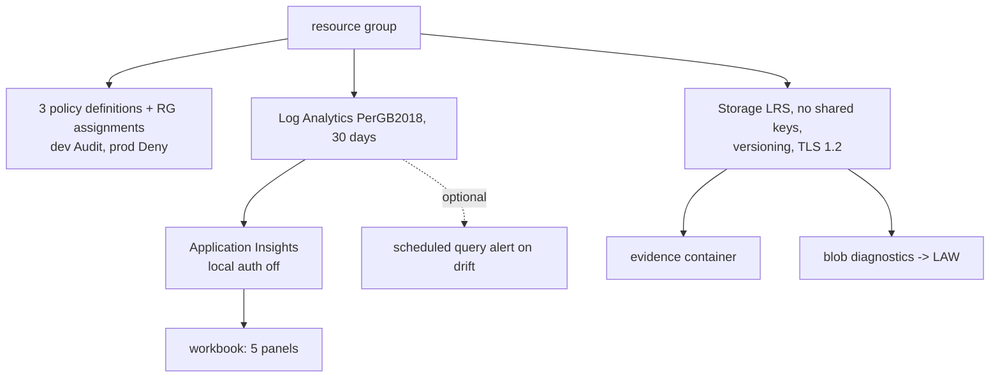

# Infrastructure: Terraform stack

The Terraform stack provisions the evidence plane for model risk: a resource group, three custom Azure Policy definitions with assignments, Log Analytics, workspace-based Application Insights, the governance workbook, a keyless versioned storage account for evidence, blob diagnostics, and an optional drift alert.

**Nothing is deployed.** Every deploy path is gated by the repository variable `DEPLOY_ENABLED`, which is not set.

Sections: [1. Purpose](#1-purpose) · [2. Architecture](#2-architecture) · [3. How it works](#3-how-it-works) · [4. Key files](#4-key-files) · [5. Code excerpts](#5-code-excerpts) · [6. Configuration](#6-configuration) · [7. Commands](#7-commands) · [8. Real output](#8-real-output) · [9. Tests and gates](#9-tests-and-gates) · [10. Guardrails](#10-guardrails) · [11. Security and governance](#11-security-and-governance) · [12. Observability](#12-observability) · [13. Failure modes](#13-failure-modes) · [14. Mapping to Azure services](#14-mapping-to-azure-services) · [15. Limitations](#15-limitations) · [16. Interview talking points](#16-interview-talking-points)

## 1. Purpose

* Make the governance controls real Azure resources: tags enforced by policy, evidence stored immutably
  enough to audit, and a workbook over the telemetry the repo emits.
* Smallest settings: LRS storage, PerGB2018 workspace with 30-day retention and a daily cap, alert off by default.

## 2. Architecture



## 3. How it works

1. `locals.tf` loads the policy JSON files from `infra/policies` and the workbook JSON.
2. `main.tf` creates the resources; names include the environment.
3. `envs/dev.tfvars` assigns policies with Audit; `envs/prod.tfvars` with Deny and the drift alert on.
4. `backend.hcl` per environment points at remote state (used only when deploying).
5. `tests/plan.tftest.hcl` runs `terraform test` with a mock provider for dev and prod.

## 4. Key files

| File | Role |
|---|---|
| `infra/terraform/main.tf` | Resources |
| `infra/terraform/locals.tf` | Policy and workbook files |
| `infra/terraform/variables.tf` | Inputs with validation |
| `infra/terraform/outputs.tf` | Outputs for the deploy script |
| `infra/terraform/envs/` | dev and prod tfvars and backends |
| `infra/terraform/tests/plan.tftest.hcl` | Plan tests with a mock provider |

## 5. Code excerpts

<!-- code: infra/terraform/main.tf::resource "azurerm_storage_account" -->
```hcl
resource "azurerm_storage_account" "evidence" {
  name                            = substr(replace("st${local.short}${var.environment}${local.region}001", "-", ""), 0, 24)
  resource_group_name             = azurerm_resource_group.this.name
  location                        = var.location
  account_tier                    = "Standard"
  account_replication_type        = "LRS"
  min_tls_version                 = "TLS1_2"
  shared_access_key_enabled       = false
  allow_nested_items_to_be_public = false
  tags                            = local.tags

  blob_properties {
    versioning_enabled = true
    delete_retention_policy {
      days = 30
    }
    container_delete_retention_policy {
      days = 30
    }
  }
}
```
<!-- /code -->

<!-- code: infra/terraform/main.tf::resource "azurerm_application_insights" -->
```hcl
resource "azurerm_application_insights" "this" {
  name                         = "appi-${local.short}-${local.suffix}"
  resource_group_name          = azurerm_resource_group.this.name
  location                     = var.location
  workspace_id                 = azurerm_log_analytics_workspace.this.id
  application_type             = "other"
  local_authentication_enabled = false
  tags                         = local.tags
}
```
<!-- /code -->

## 6. Configuration

| Variable | Default | Note |
|---|---|---|
| `environment` | none | dev or prod |
| `policy_effect` | Audit | prod tfvars sets Deny |
| `log_retention_days` | 30 | the free-retention minimum |
| `log_daily_quota_gb` | 0.5 | ingestion cap so a telemetry bug cannot run up a bill |
| `deploy_drift_alert` | false | prod tfvars sets true |

## 7. Commands

```bash
cd infra/terraform
terraform fmt -check -recursive
terraform init -backend=false
terraform validate
terraform test
tflint --init && tflint
checkov -d . --config-file ../../.checkov.yaml
# deploying is done by the gated workflow, never by hand here
```

## 8. Real output

<!-- output: iac --part terraform -->
```text
resource  azurerm_resource_group                           this
resource  azurerm_policy_definition                        this
resource  azurerm_resource_group_policy_assignment         this
resource  azurerm_log_analytics_workspace                  this
resource  azurerm_application_insights                     this
resource  azurerm_application_insights_workbook            this
resource  azurerm_storage_account                          evidence
resource  azurerm_storage_container                        evidence
resource  azurerm_monitor_diagnostic_setting               evidence_blob
resource  azurerm_monitor_action_group                     drift
resource  azurerm_monitor_scheduled_query_rules_alert_v2   drift
variables environment, location, policy_effect, log_retention_days, log_daily_quota_gb, deploy_drift_alert, alert_email, tags
outputs   AZURE_RESOURCE_GROUP, EVIDENCE_STORAGE_ACCOUNT, APPLICATIONINSIGHTS_CONNECTION_STRING, POLICY_DEFINITION_IDS, WORKBOOK_ID
tests     dev_evidence_plane, prod_denies_and_alerts
```
<!-- /output -->

## 9. Tests and gates

* `infra.yml`: fmt, validate, test, tflint and checkov on every push; plan only with OIDC variables.
* `tests/test_iac.py`: smallest settings, keyless storage, same policy files as Bicep, dev Audit / prod Deny.

## 10. Guardrails

* No shared keys on storage; Application Insights local auth disabled; TLS 1.2; versioning and soft delete.
* Checkov skips are each justified in `.checkov.yaml`.

## 11. Security and governance

* State backend uses Entra auth (`use_azuread_auth`) when configured.
* OIDC only in workflows; no secrets in the repository.

## 12. Observability

This stack *is* the observability backend: workspace, Application Insights and the workbook.

## 13. Failure modes

| Failure | Handling |
|---|---|
| Policy Deny blocks a deployment in prod | intended: add the model-card tags |
| No OIDC variables | plan job skips with a notice |

## 14. Mapping to Azure services

* **Azure Policy**: the three custom definitions are the runtime guardrail for model resources.
* **Application Insights + Log Analytics**: telemetry events and the workbook.
* **Storage (evidence registry)**: gate reports, telemetry, model cards and the audit log.
* **Foundry evaluations** results and **Purview** scans would land in the same evidence container and
  workspace; Purview would register the storage account as a data source.

## 15. Limitations

* No private endpoints (cost); the deny-public-endpoints policy applies to AI resources, not to the evidence account.
* Workbook queries assume the event names from `telemetry.py`.

## 16. Interview talking points

* "Terraform and Bicep load the same policy JSON, and a test proves it."
* "Dev audits, prod denies: the same policy, a different effect."
