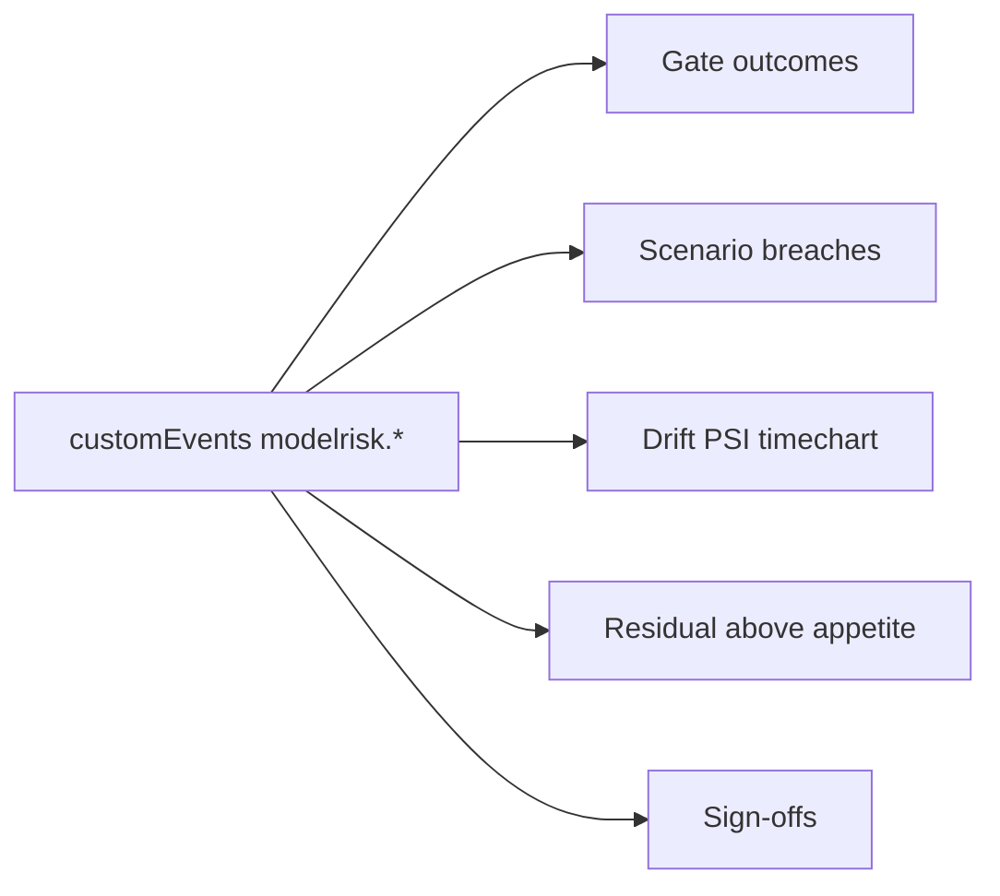

# Infrastructure: governance workbook

An Azure Monitor workbook with five panels over the events from `modelrisk telemetry`: gate outcomes, scenario breaches, drift, residual risk above appetite and HITL sign-offs.

**Nothing is deployed.** Every deploy path is gated by the repository variable `DEPLOY_ENABLED`, which is not set.

Sections: [1. Purpose](#1-purpose) · [2. Architecture](#2-architecture) · [3. How it works](#3-how-it-works) · [4. Key files](#4-key-files) · [5. Code excerpts](#5-code-excerpts) · [6. Configuration](#6-configuration) · [7. Commands](#7-commands) · [8. Real output](#8-real-output) · [9. Tests and gates](#9-tests-and-gates) · [10. Guardrails](#10-guardrails) · [11. Security and governance](#11-security-and-governance) · [12. Observability](#12-observability) · [13. Failure modes](#13-failure-modes) · [14. Mapping to Azure services](#14-mapping-to-azure-services) · [15. Limitations](#15-limitations) · [16. Interview talking points](#16-interview-talking-points)

## 1. Purpose

* Give model risk, owners and auditors one view of the governance state.

## 2. Architecture



## 3. How it works

1. The JSON is a workbook (version Notebook/1.0) with KQL query items.
2. Terraform and Bicep both deploy it from the same file.
3. Queries filter `customEvents` by name and read `customDimensions`.

## 4. Key files

| File | Role |
|---|---|
| `infra/workbook/model-risk-workbook.json` | The workbook |
| `src/modelrisk/telemetry.py` | The events it reads |

## 5. Code excerpts

<!-- code: src/modelrisk/iac.py::workbook -->
```python
def workbook() -> list[str]:
    d = json.loads((INFRA / "workbook/model-risk-workbook.json").read_text())
    out = []
    for item in d["items"]:
        c = item["content"]
        if "query" in c:
            event = re.search(r"name == '([^']+)'", c["query"]).group(1)
            out.append(f"{c['title']:<32} {event:<20} {c['visualization']}")
    return out
```
<!-- /code -->

## 6. Configuration

No parameters; the workspace is the deployment target.

## 7. Commands

```bash
modelrisk iac --part workbook
modelrisk telemetry --out evidence/telemetry.jsonl
```

## 8. Real output

<!-- output: iac --part workbook -->
```text
Gate outcomes by model           modelrisk.gate       table
Scenario breaches                modelrisk.scenario   table
Drift (PSI) by model             modelrisk.drift      timechart
Residual risk above appetite     modelrisk.residual   table
HITL sign-offs                   modelrisk.signoff    table
```
<!-- /output -->

## 9. Tests and gates

* `tests/test_iac.py` checks the workbook queries all five event names and both stacks load it.

## 10. Guardrails

* Read-only view; no actions.

## 11. Security and governance

Access via Azure RBAC on the resource group.

## 12. Observability

This is the dashboard layer.

## 13. Failure modes

| Failure | Handling |
|---|---|
| No events yet | empty panels; the deploy publish step sends the first batch |

## 14. Mapping to Azure services

* **Azure Policy**: the three custom definitions are the runtime guardrail for model resources.
* **Application Insights + Log Analytics**: telemetry events and the workbook.
* **Storage (evidence registry)**: gate reports, telemetry, model cards and the audit log.
* **Foundry evaluations** results and **Purview** scans would land in the same evidence container and
  workspace; Purview would register the storage account as a data source.

## 15. Limitations

* Events are only sent when the gated deploy runs.

## 16. Interview talking points

* "The dashboard reads the same events the CLI computes, so it cannot disagree with CI."
