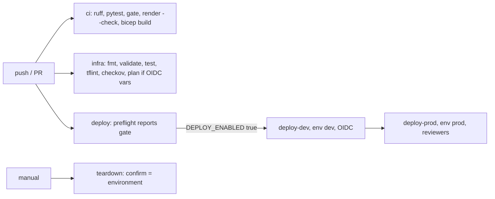

# Infrastructure: GitHub Actions workflows

Four workflows: `ci` (lint, tests, gate, doc drift, bicep build), `infra` (Terraform fmt, validate, test, tflint, checkov, and a credential-gated plan), `deploy` (preflight, then dev and prod with OIDC and environment approval, Terraform or Bicep) and `teardown` (manual, confirmation required). Deploy and teardown are gated by `DEPLOY_ENABLED`.

**Nothing is deployed.** Every deploy path is gated by the repository variable `DEPLOY_ENABLED`, which is not set.

Sections: [1. Purpose](#1-purpose) · [2. Architecture](#2-architecture) · [3. How it works](#3-how-it-works) · [4. Key files](#4-key-files) · [5. Code excerpts](#5-code-excerpts) · [6. Configuration](#6-configuration) · [7. Commands](#7-commands) · [8. Real output](#8-real-output) · [9. Tests and gates](#9-tests-and-gates) · [10. Guardrails](#10-guardrails) · [11. Security and governance](#11-security-and-governance) · [12. Observability](#12-observability) · [13. Failure modes](#13-failure-modes) · [14. Mapping to Azure services](#14-mapping-to-azure-services) · [15. Limitations](#15-limitations) · [16. Interview talking points](#16-interview-talking-points)

## 1. Purpose

* Keep the repository green on every push and make deployment a deliberate, approved act.

## 2. Architecture



## 3. How it works

1. `ci.yml` runs ruff, pytest, `modelrisk gate`, `render_docs.py --check`, and builds Bicep.
2. `infra.yml` checks Terraform; the plan job skips with a notice when OIDC variables are missing.
3. `deploy.yml` preflight writes the gate state; dev and prod jobs run `deploy.sh provision`, `smoke`
   and `publish` with the chosen tool.
4. `teardown.yml` needs the environment typed again as confirmation.

## 4. Key files

| File | Role |
|---|---|
| `.github/workflows/ci.yml` | Tests and gate |
| `.github/workflows/infra.yml` | IaC checks |
| `.github/workflows/deploy.yml` | Gated deploy |
| `.github/workflows/teardown.yml` | Gated teardown |
| `.github/scripts/deploy.sh` | provision, smoke, publish, destroy |

## 5. Code excerpts

<!-- code: src/modelrisk/iac.py::workflows -->
```python
def workflows() -> list[str]:
    out = []
    for f in sorted((ROOT / ".github/workflows").glob("*.yml")):
        d = yaml.safe_load(f.read_text())
        on = d.get(True, d.get("on"))
        triggers = ",".join(on) if isinstance(on, dict) else str(on)
        for job, spec in d["jobs"].items():
            gate = "DEPLOY_ENABLED" if "DEPLOY_ENABLED" in str(spec.get("if", "")) else "-"
            env = spec.get("environment", "-")
            oidc = "oidc" if spec.get("permissions", {}).get("id-token") == "write" else "-"
            out.append(f"{f.name:<14} {job:<12} on={triggers:<34} gate={gate:<15} env={env!s:<26} {oidc}")
    return out
```
<!-- /code -->

## 6. Configuration

| Variable | Purpose |
|---|---|
| `DEPLOY_ENABLED` | must be `true` for deploy/teardown (unset) |
| `AZURE_CLIENT_ID`, `AZURE_TENANT_ID`, `AZURE_SUBSCRIPTION_ID` | OIDC federated credential |
| `DEPLOY_TOOL` | terraform or bicep |
| Environments `dev`, `prod` | prod with required reviewers |

## 7. Commands

```bash
modelrisk iac --part workflows
gh workflow run deploy.yml -f deploy_tool=bicep   # does nothing until DEPLOY_ENABLED is set
```

## 8. Real output

<!-- output: iac --part workflows -->
```text
ci.yml         test         on=push,pull_request                  gate=-               env=-                          -
ci.yml         bicep        on=push,pull_request                  gate=-               env=-                          -
deploy.yml     preflight    on=push,workflow_dispatch             gate=-               env=-                          -
deploy.yml     deploy-dev   on=push,workflow_dispatch             gate=DEPLOY_ENABLED  env=dev                        oidc
deploy.yml     deploy-prod  on=push,workflow_dispatch             gate=DEPLOY_ENABLED  env=prod                       oidc
infra.yml      terraform    on=pull_request,push,workflow_dispatch gate=-               env=-                          -
infra.yml      tflint       on=pull_request,push,workflow_dispatch gate=-               env=-                          -
infra.yml      checkov      on=pull_request,push,workflow_dispatch gate=-               env=-                          -
infra.yml      plan         on=pull_request,push,workflow_dispatch gate=-               env=-                          oidc
teardown.yml   teardown     on=workflow_dispatch                  gate=DEPLOY_ENABLED  env=${{ inputs.environment }}  oidc
```
<!-- /output -->

## 9. Tests and gates

* `tests/test_iac.py`: gating, OIDC permissions, environments, prod needs dev, tool options, teardown confirm, no client secrets.

## 10. Guardrails

* No client secrets anywhere; concurrency groups prevent overlapping deploys.

## 11. Security and governance

Least-privilege permissions per job (`contents: read`, `id-token: write` only where needed).

## 12. Observability

Job summaries report the gate and skipped steps.

## 13. Failure modes

| Failure | Handling |
|---|---|
| Variable unset | deploy jobs skipped, preflight green |
| Prod approval missing | prod waits |

## 14. Mapping to Azure services

* **Azure Policy**: the three custom definitions are the runtime guardrail for model resources.
* **Application Insights + Log Analytics**: telemetry events and the workbook.
* **Storage (evidence registry)**: gate reports, telemetry, model cards and the audit log.
* **Foundry evaluations** results and **Purview** scans would land in the same evidence container and
  workspace; Purview would register the storage account as a data source.

## 15. Limitations

* The prod approval relies on GitHub environment protection rules configured outside the repo.

## 16. Interview talking points

* "CI proves the governance; deploy is gated, OIDC-only and approved per environment."
