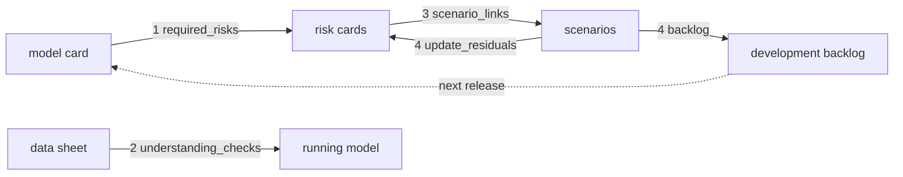

# How the pillars combine

The four pillars are only useful together. This repository implements the combination as four
executable links: the model card implies risks, the data sheet is checked against the model, risk
cards drive scenarios, and scenario results update residual risk and generate the development
backlog. The emphasis on combining the tools comes from the Cloud Security Alliance AI Technology
and Risk working group ([framework page](https://cloudsecurityalliance.org/research/working-groups/ai-technology-and-risk));
the link rules and code are this repository's own.

Sections: [1. Purpose](#1-purpose) · [2. Architecture](#2-architecture) · [3. How it works](#3-how-it-works) · [4. Key files](#4-key-files) · [5. Code excerpts](#5-code-excerpts) · [6. Configuration](#6-configuration) · [7. Commands](#7-commands) · [8. Real output](#8-real-output) · [9. Tests and gates](#9-tests-and-gates) · [10. Guardrails](#10-guardrails) · [11. Security and governance](#11-security-and-governance) · [12. Observability](#12-observability) · [13. Failure modes](#13-failure-modes) · [14. Mapping to Azure services](#14-mapping-to-azure-services) · [15. Limitations](#15-limitations) · [16. Interview talking points](#16-interview-talking-points)

## 1. Purpose

* Make gaps between pillars visible and blocking: a card that implies a risk nobody wrote down,
  a data sheet that disagrees with the code, a material risk no scenario tests, or a scenario
  result that never changes anything.

## 2. Architecture



## 3. How it works

1. **Model card → risk cards.** `required_risks(card)` derives families from the card: drift
   always; injection and outage for LLM agents; hallucination when an LLM rationale reaches
   decisions about people; tool misuse for acting agents with tools; PII leak for PII or PHI; bias
   when protected attributes are named; cost spike at 100,000 or more a month. `risk_coverage`
   checks each family has a scenario on the risk cards. This link found a real gap while the repo
   was built: the retail agent reads supplier notes but had no injection risk, so RTL-R7 and
   RTL-S7 were added.
2. **Data sheet → model understanding.** Nine checks compare the data sheet with the agent and with
   re-run evaluations (see the data sheet doc).
3. **Risk cards → scenarios.** `scenario_links` requires each material risk to be linked to an
   existing scenario, each scenario to cite existing risks, and the linked risks to carry a runtime
   control for the scenario family, so the what-if has something to switch off.
4. **Scenario results → residual risk and backlog.** `update_residuals` credits controls at 1.0 /
   0.5 / 0 for pass / warn / breach; `backlog` creates P1 items for breaches and appetite excess,
   P2 for warn bands and planned controls, P3 for scenarios whose what-if still passes.

## 4. Key files

| File | Role |
|---|---|
| `src/modelrisk/combine.py` | All four links and `summary` |
| `src/modelrisk/gate.py` | G5 (links) and G6 (appetite) |
| `src/modelrisk/cli.py` | `modelrisk combine --model ID` |

## 5. Code excerpts

<!-- code: src/modelrisk/combine.py::required_risks -->
```python
def required_risks(card: dict[str, Any]) -> list[dict[str, str]]:
    """Scenario families the model card says must be on the risk cards, with the reason."""
    req = [("data-drift", "every statistical model drifts")]
    sysd, impact = card["system"], card["decision_impact"]
    if sysd["type"] == "agentic-llm":
        req += [("prompt-injection", "an LLM reads untrusted text"), ("model-outage", "depends on a hosted model")]
        if impact["affects_individuals"]:
            req.append(("hallucination", "a generated rationale reaches decisions about people"))
    if sysd["autonomy"] in ("act", "act-with-approval") and sysd["tools"]:
        req.append(("tool-misuse", f"autonomy is {sysd['autonomy']} with tools"))
    if set(card["data_sensitivity"]) & {"pii", "phi"}:
        req.append(("pii-leak", "processes " + "/".join(sorted(set(card["data_sensitivity"]) & {"pii", "phi"}))))
    if card["fairness"]["protected_attributes"]:
        req.append(("bias", "fairness section names protected attributes"))
    if card.get("monthly_volume", 0) >= 100_000:
        req.append(("cost-spike", "monthly volume of 100,000 or more"))
    return [{"kind": k, "reason": r} for k, r in req]
```
<!-- /code -->

<!-- code: src/modelrisk/combine.py::update_residuals -->
```python
def update_residuals(rec: ModelRecord, results: list[dict[str, Any]] | None = None) -> list[dict[str, Any]]:
    """Re-score each risk with control credit adjusted by the scenarios that exercise it."""
    results = results if results is not None else scenario_results(rec)
    t = tier(rec.model_card)
    worst: dict[str, str] = {}
    order = ["pass", "warn", "breach"]
    for res in results:
        for rid in res["risk_ids"]:
            if order.index(res["status"]) >= order.index(worst.get(rid, "pass")):
                worst[rid] = res["status"]
    out = []
    for r in rec.risks():
        before = score_risk(r)
        credit = CREDIT[worst.get(r["id"], "pass")]
        overrides = {c["id"]: c["effectiveness"] * credit for c in r["controls"] if c.get("runtime_control") or rec.kind == "portfolio"}
        after = score_risk(r, overrides)
        out.append(
            {
                **after,
                "residual_before": before["residual"],
                "scenario_status": worst.get(r["id"], "not-tested"),
                "within_appetite": within_appetite(after["residual_band"], t),
            }
        )
    return out
```
<!-- /code -->

<!-- code: src/modelrisk/combine.py::backlog -->
```python
def backlog(rec: ModelRecord, results: list[dict[str, Any]] | None = None, what_if: list[dict[str, Any]] | None = None) -> list[dict[str, str]]:
    """Development backlog generated from scenario results, what-ifs and the risk cards."""
    results = results if results is not None else scenario_results(rec)
    what_if = what_if if what_if is not None else (scenario_results(rec, mitigations=False) if rec.kind == "domain" else [])
    items: list[dict[str, str]] = []
    for res in results:
        if res["status"] == "breach":
            items.append(
                {"priority": "P1", "source": res["id"], "item": f"Fix: {res['metric']} {res['value']} breaches {res['threshold']}; block promotion"}
            )
        elif res["status"] == "warn":
            items.append(
                {"priority": "P2", "source": res["id"], "item": f"Tune: {res['metric']} {res['value']} is inside the warn band ({res['threshold']})"}
            )
    for res in what_if:
        if res["status"] == "pass":
            items.append(
                {
                    "priority": "P3",
                    "source": res["id"],
                    "item": f"Strengthen scenario: still passes with {res['mitigations']}, so it does not prove the control is needed",
                }
            )
    for r in rec.risks():
        for c in r["controls"]:
            if c["status"] == "planned":
                items.append({"priority": "P2", "source": c["id"], "item": f"Implement planned control for {r['id']}: {c['description']}"})
    for r in update_residuals(rec, results):
        if not r["within_appetite"]:
            items.append(
                {
                    "priority": "P1",
                    "source": r["id"],
                    "item": f"Residual {r['residual']} ({r['residual_band']}) exceeds tier appetite; add controls or record acceptance",
                }
            )
    return items
```
<!-- /code -->

## 6. Configuration

* `CREDIT` in `combine.py` sets the pass / warn / breach credit.
* Material risk threshold for scenario links: inherent 10 or more.
* Volume threshold for the cost-spike family: 100,000 a month.

## 7. Commands

```bash
modelrisk combine --model juniper-prior-auth
modelrisk combine --model halcyon-fraud-triage
modelrisk combine --model marigold-pricing-demand
```

## 8. Real output

<!-- output: combine --model juniper-prior-auth -->
```text
1. model card -> risk cards
kind              reason                                                covered_by  ok
----------------  ----------------------------------------------------  ----------  --
data-drift        every statistical model drifts                        HC-R8       ok
prompt-injection  an LLM reads untrusted text                           HC-R3       ok
model-outage      depends on a hosted model                             HC-R5       ok
hallucination     a generated rationale reaches decisions about people  HC-R2       ok
tool-misuse       autonomy is act with tools                            HC-R4       ok
pii-leak          processes phi/pii                                     HC-R1       ok
bias              fairness section names protected attributes           HC-R6       ok
cost-spike        monthly volume of 100,000 or more                     HC-R7       ok

2. data sheet -> model understanding
id                          ok  detail
--------------------------  --  -----------------------------------------------------------------------------------------------------------------------------------------------------------------
DS1-inputs-documented       ok  7 inputs documented
DS2-synthetic-declared      ok  training data declared synthetic
DS3-features-match          ok  data sheet ['conservative_weeks', 'days_since_imaging', 'doc_score', 'red_flags'] vs model ['conservative_weeks', 'days_since_imaging', 'doc_score', 'red_flags']
DS4-ranges-match            ok  all ranges match
DS5-protected-not-used      ok  no protected input reaches the model
DS6-proxies-documented      ok  1 known proxies documented and excluded
DS7-training-in-range       ok  reference data inside every range
DS8-performance-reproduces  ok  train and validation figures reproduce within 0.02
DS9-card-matches-sheet      ok  model card metrics match the data sheet

3. risk cards -> scenarios
risk   material  scenarios  ok
-----  --------  ---------  --
HC-R1  True      HC-S1      ok
HC-R2  True      HC-S2      ok
HC-R3  True      HC-S3      ok
HC-R4  True      HC-S4      ok
HC-R5  False     HC-S5      ok
HC-R6  True      HC-S6      ok
HC-R7  False     HC-S7      ok
HC-R8  False     HC-S8      ok

4. scenario results -> residual risk
risk   inherent  residual (card)  scenarios  residual (tested)  band  in appetite
-----  --------  ---------------  ---------  -----------------  ----  -----------
HC-R1  20        1.8              pass       1.8                low   True
HC-R2  12        2.4              pass       2.4                low   True
HC-R3  12        3.6              pass       3.6                low   True
HC-R4  15        1.5              pass       1.5                low   True
HC-R5  9         2.7              pass       2.7                low   True
HC-R6  12        3.0              pass       3.0                low   True
HC-R7  6         1.2              warn       3.6                low   True
HC-R8  9         3.15             pass       3.15               low   True

4. development backlog
priority  source  item
--------  ------  --------------------------------------------------------------------
P2        HC-S7   Tune: max_cost_usd_per_task 0.0299 is inside the warn band (<= 0.05)
```
<!-- /output -->

The fraud agent's backlog shows planned controls and the age-band scenario that does not exercise its control:

<!-- output: combine --model halcyon-fraud-triage -->
```text
1. model card -> risk cards
kind              reason                                                covered_by  ok
----------------  ----------------------------------------------------  ----------  --
data-drift        every statistical model drifts                        BNK-R1      ok
prompt-injection  an LLM reads untrusted text                           BNK-R2      ok
model-outage      depends on a hosted model                             BNK-R4      ok
hallucination     a generated rationale reaches decisions about people  BNK-R8      ok
tool-misuse       autonomy is act with tools                            BNK-R3      ok
pii-leak          processes pii                                         BNK-R5      ok
bias              fairness section names protected attributes           BNK-R7      ok
cost-spike        monthly volume of 100,000 or more                     BNK-R6      ok

2. data sheet -> model understanding
id                          ok  detail
--------------------------  --  ---------------------------------------------------------------------------------------------------------------------------------------------------------------------
DS1-inputs-documented       ok  7 inputs documented
DS2-synthetic-declared      ok  training data declared synthetic
DS3-features-match          ok  data sheet ['amount', 'device_age_days', 'geo_mismatch', 'mcc_risk', 'velocity_1h'] vs model ['amount', 'device_age_days', 'geo_mismatch', 'mcc_risk', 'velocity_1h']
DS4-ranges-match            ok  all ranges match
DS5-protected-not-used      ok  no protected input reaches the model
DS6-proxies-documented      ok  0 known proxies documented and excluded
DS7-training-in-range       ok  reference data inside every range
DS8-performance-reproduces  ok  train and validation figures reproduce within 0.02
DS9-card-matches-sheet      ok  model card metrics match the data sheet

3. risk cards -> scenarios
risk    material  scenarios  ok
------  --------  ---------  --
BNK-R1  True      BNK-S1     ok
BNK-R2  True      BNK-S2     ok
BNK-R3  True      BNK-S3     ok
BNK-R4  False     BNK-S4     ok
BNK-R5  True      BNK-S5     ok
BNK-R6  False     BNK-S6     ok
BNK-R7  False     BNK-S7     ok
BNK-R8  False     BNK-S8     ok

4. scenario results -> residual risk
risk    inherent  residual (card)  scenarios  residual (tested)  band  in appetite
------  --------  ---------------  ---------  -----------------  ----  -----------
BNK-R1  16        3.36             pass       3.36               low   True
BNK-R2  12        1.8              pass       1.8                low   True
BNK-R3  12        1.2              pass       1.2                low   True
BNK-R4  9         2.7              pass       2.7                low   True
BNK-R5  12        1.44             pass       1.44               low   True
BNK-R6  6         1.2              pass       1.2                low   True
BNK-R7  6         2.4              pass       2.4                low   True
BNK-R8  9         1.8              pass       1.8                low   True

4. development backlog
priority  source   item
--------  -------  -------------------------------------------------------------------------------------------------------
P3        BNK-S7   Strengthen scenario: still passes with off: exclude_proxies, so it does not prove the control is needed
P2        BNK-C3   Implement planned control for BNK-R1: Champion-challenger retraining on confirmed fraud every quarter
P2        BNK-C13  Implement planned control for BNK-R7: Monthly hold-rate comparison by age band
```
<!-- /output -->

## 9. Tests and gates

* `tests/test_combine.py` covers each link failing in isolation, the residual credit rules and
  every backlog priority.
* Gate G5 fails on any broken link; G6 on residual above appetite.

## 10. Guardrails

* Links are evaluated on every CI run, not at review time only.
* The backlog is generated, so it cannot be forgotten or edited away.

## 11. Security and governance

The combine report is the evidence pack for a validation or production sign-off: one command
shows coverage, understanding, linkage, residuals and outstanding work.

## 12. Observability

`modelrisk.residual` and `modelrisk.scenario` events feed the workbook; backlog items are in
the gate JSON report uploaded to the evidence registry.

## 13. Failure modes

| Failure | Caught by |
|---|---|
| Card implies a family with no scenario | link 1, G5 |
| Data sheet drifts from code | link 2, G5 and validation V7 |
| Material risk untested | link 3, G5 |
| Breach ignored | link 4: residual rises, P1 item, G4 and possibly G6 fail |

## 14. Mapping to Azure services

* **Foundry evaluations** produce the scenario evidence on hosted deployments.
* **Microsoft Purview** holds the data-sheet side (assets, classifications, lineage).
* **Azure Policy** enforces the tags that tie resources back to cards.
* **Application Insights** and the workbook show residuals and breaches over time.

## 15. Limitations

* Rules in `required_risks` are deliberately simple and explicit; a real programme would extend them.
* Backlog items are not synced to a ticketing system here.

## 16. Interview talking points

* "The pillars are wired together in code, and the wiring found a missing risk while I was building it."
* "A scenario that breaches lowers residual risk credit automatically and opens a P1 item."
* "Backlog priorities are rules, not opinions: breach P1, warn P2, weak scenario P3.
