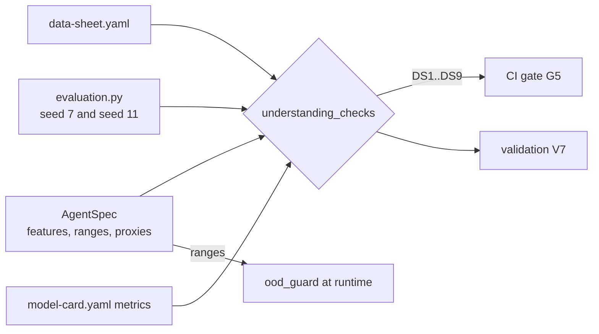

# Pillar 2: data sheets

A data sheet explains the data and the model's mechanics in enough detail that a validator can
check understanding instead of trusting it: every input with its source, range, sensitivity and
whether the model uses it; the assumptions; the architecture and settings; how training data was
built; development and performance; and how to read the outputs. This repository turns the data
sheet into a set of executable *understanding checks* against the running agent. The data sheet as
a pillar is credited to the Cloud Security Alliance AI Technology and Risk working group
([framework page](https://cloudsecurityalliance.org/research/working-groups/ai-technology-and-risk));
the checks are this repository's own.

Sections: [1. Purpose](#1-purpose) · [2. Architecture](#2-architecture) · [3. How it works](#3-how-it-works) · [4. Key files](#4-key-files) · [5. Code excerpts](#5-code-excerpts) · [6. Configuration](#6-configuration) · [7. Commands](#7-commands) · [8. Real output](#8-real-output) · [9. Tests and gates](#9-tests-and-gates) · [10. Guardrails](#10-guardrails) · [11. Security and governance](#11-security-and-governance) · [12. Observability](#12-observability) · [13. Failure modes](#13-failure-modes) · [14. Mapping to Azure services](#14-mapping-to-azure-services) · [15. Limitations](#15-limitations) · [16. Interview talking points](#16-interview-talking-points)

## 1. Purpose

* Document inputs, assumptions and mechanics so a reviewer knows what the model actually sees.
* Prove the documentation is true: the declared model inputs must equal the agent's feature list,
  ranges must match, protected attributes and known proxies must be documented and unused, and the
  recorded performance must reproduce.

## 2. Architecture



## 3. How it works

1. Each input lists name, type, source, range or categories, preprocessing, sensitivity and
   `used_by_model`.
2. `combine.understanding_checks` runs nine checks:
   DS1 inputs documented, DS2 synthetic declared, DS3 declared model inputs equal the agent's
   features, DS4 ranges match, DS5 no protected input is used, DS6 every known proxy is documented
   as protected, DS7 reference data falls inside the ranges, DS8 train and validation performance
   reproduce within 0.02, DS9 card metrics agree with the data sheet.
3. The same ranges feed the agent's out-of-range guard at runtime, so the data sheet is also a
   control: inputs outside the documented range go to a human.
4. Portfolio components get DS1 and DS2 only; their mechanics are tested in their own repos.

## 4. Key files

| File | Role |
|---|---|
| `schemas/data-sheet.schema.json` | Input, architecture, training data, performance and output structure |
| `registry/<model-id>/data-sheet.yaml` | One per model |
| `src/modelrisk/combine.py` | `understanding_checks` |
| `src/modelrisk/agents/base.py` | `out_of_range`: the runtime use of the ranges |

## 5. Code excerpts

<!-- code: src/modelrisk/combine.py::understanding_checks -->
```python
def understanding_checks(rec: ModelRecord) -> list[dict[str, Any]]:
    sheet, card = rec.data_sheet, rec.model_card
    checks: list[dict[str, Any]] = []

    def add(cid: str, ok: bool, detail: str) -> None:
        checks.append({"id": cid, "ok": bool(ok), "detail": detail})

    inputs = {i["name"]: i for i in sheet["inputs"]}
    add("DS1-inputs-documented", bool(inputs), f"{len(inputs)} inputs documented")
    add("DS2-synthetic-declared", sheet["training_data"]["synthetic"], "training data declared synthetic")
    if rec.kind == "portfolio":
        return checks
    spec = SPECS[rec.id]
    used = {n for n, i in inputs.items() if i["used_by_model"]}
    add("DS3-features-match", used == set(spec.features), f"data sheet {sorted(used)} vs model {sorted(spec.features)}")
    bad_range = [f for f in spec.features if f in inputs and tuple(inputs[f].get("range", ())) != tuple(spec.ranges[f])]
    add("DS4-ranges-match", not bad_range, "ranges differ: " + ",".join(bad_range) if bad_range else "all ranges match")
    leaked = [n for n, i in inputs.items() if i["sensitivity"] == "protected" and i["used_by_model"]]
    add("DS5-protected-not-used", not leaked, "protected inputs used: " + ",".join(leaked) if leaked else "no protected input reaches the model")
    undocumented = [p for p in spec.proxy_weights if p not in inputs or inputs[p]["sensitivity"] != "protected"]
    add(
        "DS6-proxies-documented",
        not undocumented,
        "proxies not documented as protected: " + ",".join(undocumented)
        if undocumented
        else f"{len(spec.proxy_weights)} known proxies documented and excluded",
    )
    ref = _eval(rec.id, 7)
    outside = [f for f in spec.features if not all(spec.ranges[f][0] <= v <= spec.ranges[f][1] for v in ref["features"][f])]
    add(
        "DS7-training-in-range",
        not outside,
        "reference data outside documented range: " + ",".join(outside) if outside else "reference data inside every range",
    )
    val = _eval(rec.id, 11)
    drift = [p["metric"] for p in sheet["performance"] if abs(p["train"] - ref[p["metric"]]) > 0.02 or abs(p["validation"] - val[p["metric"]]) > 0.02]
    add(
        "DS8-performance-reproduces",
        not drift,
        "not reproduced: " + ",".join(drift) if drift else "train and validation figures reproduce within 0.02",
    )
    card_vals = {m["name"]: m["value"] for m in card["metrics"]}
    mismatch = [p["metric"] for p in sheet["performance"] if p["metric"] in card_vals and abs(card_vals[p["metric"]] - p["train"]) > 0.02]
    add(
        "DS9-card-matches-sheet",
        not mismatch,
        "model card and data sheet disagree: " + ",".join(mismatch) if mismatch else "model card metrics match the data sheet",
    )
    return checks
```
<!-- /code -->

<!-- code: src/modelrisk/agents/base.py::out_of_range -->
```python
def out_of_range(spec: AgentSpec, x: dict[str, float]) -> list[str]:
    return [f for f in spec.features if not (spec.ranges[f][0] <= x[f] <= spec.ranges[f][1])]
```
<!-- /code -->

## 6. Configuration

* Tolerance for reproduced performance: 0.02 (DS8, DS9).
* `sensitivity: protected` plus `used_by_model: false` is the only valid combination for protected
  attributes and proxies.
* Ranges are inclusive and must match the agent spec exactly.

## 7. Commands

```bash
modelrisk combine --model cedarhollow-underwriting-assistant
modelrisk combine --model halcyon-fraud-triage
```

## 8. Real output

The data-sheet section of the combine report for the mortgage assistant:

<!-- output: combine --model cedarhollow-underwriting-assistant -->
```text
1. model card -> risk cards
kind              reason                                                covered_by  ok
----------------  ----------------------------------------------------  ----------  --
data-drift        every statistical model drifts                        MTG-R5      ok
prompt-injection  an LLM reads untrusted text                           MTG-R3      ok
model-outage      depends on a hosted model                             MTG-R6      ok
hallucination     a generated rationale reaches decisions about people  MTG-R2      ok
tool-misuse       autonomy is act-with-approval with tools              MTG-R7      ok
pii-leak          processes pii                                         MTG-R4      ok
bias              fairness section names protected attributes           MTG-R1      ok

2. data sheet -> model understanding
id                          ok  detail
--------------------------  --  -----------------------------------------------------------------------------------------------------------------------------------------------
DS1-inputs-documented       ok  10 inputs documented
DS2-synthetic-declared      ok  training data declared synthetic
DS3-features-match          ok  data sheet ['credit_score', 'dti', 'income_k', 'ltv', 'reserves_months'] vs model ['credit_score', 'dti', 'income_k', 'ltv', 'reserves_months']
DS4-ranges-match            ok  all ranges match
DS5-protected-not-used      ok  no protected input reaches the model
DS6-proxies-documented      ok  1 known proxies documented and excluded
DS7-training-in-range       ok  reference data inside every range
DS8-performance-reproduces  ok  train and validation figures reproduce within 0.02
DS9-card-matches-sheet      ok  model card metrics match the data sheet

3. risk cards -> scenarios
risk    material  scenarios      ok
------  --------  -------------  --
MTG-R1  True      MTG-S1,MTG-S2  ok
MTG-R2  True      MTG-S3         ok
MTG-R3  True      MTG-S4         ok
MTG-R4  True      MTG-S5         ok
MTG-R5  True      MTG-S6         ok
MTG-R6  False     MTG-S7         ok
MTG-R7  True      MTG-S8         ok

4. scenario results -> residual risk
risk    inherent  residual (card)  scenarios  residual (tested)  band  in appetite
------  --------  ---------------  ---------  -----------------  ----  -----------
MTG-R1  20        1.6              pass       1.6                low   True
MTG-R2  12        2.4              pass       2.4                low   True
MTG-R3  12        1.8              pass       1.8                low   True
MTG-R4  12        2.4              pass       2.4                low   True
MTG-R5  12        4.2              pass       4.2                low   True
MTG-R6  6         1.8              pass       1.8                low   True
MTG-R7  15        1.5              pass       1.5                low   True

4. development backlog
priority  source  item
--------  ------  -----------------------------------------------------------------------------------
P2        MTG-C3  Implement planned control for MTG-R1: Annual less-discriminatory-alternative search
```
<!-- /output -->

## 9. Tests and gates

* `tests/test_combine.py` mutates data sheets in memory and checks each failure is caught: range
  mismatch (DS4), a protected input marked used (DS3 and DS5), an undocumented proxy (DS6),
  overstated performance (DS8 and DS9).
* Gate G5 fails on any failed understanding check; validation finding V7 is high severity.

## 10. Guardrails

* The tract minority share (mortgage), zip risk index (insurance), plan type (healthcare) and store
  income band (retail) are documented as protected proxies and kept out of the model.
* Free text fields are documented as untrusted and screened.

## 11. Security and governance

Data sheets are where privacy and fairness reviewers start. Because DS5 and DS6 run on every
change, a proxy cannot quietly enter the feature list without failing CI.

## 12. Observability

Range violations at runtime raise the `out-of-range` flag; the drift scenario reports how many
cases were flagged, and monitoring reports PSI per documented input.

## 13. Failure modes

| Failure | Caught by |
|---|---|
| New feature added to the agent but not to the data sheet | DS3 |
| Range widened in code only | DS4 |
| Proxy added as a feature | DS3, DS5, DS6 and the bias scenario |
| Performance copied from an old run | DS8 |

## 14. Mapping to Azure services

* **Microsoft Purview**: inputs map to Purview data assets with classifications (PII, PHI,
  financial) and lineage from source systems; DS5 and DS6 correspond to Purview sensitivity labels.
* **Foundry evaluations**: DS8 is the place to attach Foundry evaluation runs on the validation set.
* **Azure Policy**: storage holding training data would carry the same tags as the model resource.
* **Application Insights**: PSI per input is emitted as `modelrisk.drift`.

## 15. Limitations

* Synthetic data has no missing values or label noise beyond the generator.
* Ranges are simple intervals; real inputs need distribution profiles and category drift checks.

## 16. Interview talking points

* "The data sheet is tested against the running model: nine checks, from feature lists to
  reproducible performance."
* "The same documented ranges are a runtime control: out-of-range inputs skip the model."
* "Proxies are first-class: documenting them as protected is what lets CI prove they are unused.
