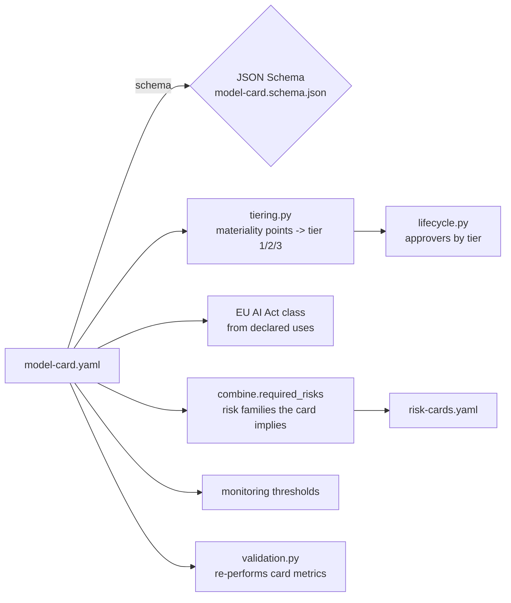

# Pillar 1: model cards

A model card is the identity document of a model: what it is for, what it must not be used for,
how it was evaluated, where it breaks and who answers for it. Here it is a YAML file validated by a
JSON Schema, and the inventory tier, the EU AI Act class and the risks the model must carry are all
computed from it. The idea of a model card as one of four complementary tools comes from the Cloud
Security Alliance AI Technology and Risk working group
([CSA AI Model Risk Management Framework](https://cloudsecurityalliance.org/research/working-groups/ai-technology-and-risk));
the schema, fields and code below are this repository's own design.

Sections: [1. Purpose](#1-purpose) · [2. Architecture](#2-architecture) · [3. How it works](#3-how-it-works) · [4. Key files](#4-key-files) · [5. Code excerpts](#5-code-excerpts) · [6. Configuration](#6-configuration) · [7. Commands](#7-commands) · [8. Real output](#8-real-output) · [9. Tests and gates](#9-tests-and-gates) · [10. Guardrails](#10-guardrails) · [11. Security and governance](#11-security-and-governance) · [12. Observability](#12-observability) · [13. Failure modes](#13-failure-modes) · [14. Mapping to Azure services](#14-mapping-to-azure-services) · [15. Limitations](#15-limitations) · [16. Interview talking points](#16-interview-talking-points)

## 1. Purpose

* Give every model, including agentic systems and platform components, one machine-readable
  description that owners, validators, auditors and the CI gate all read.
* Make the card *drive* governance instead of decorating it: the tier, the EU AI Act class, the
  required risk families and the monitoring thresholds all come from fields on the card.
* Keep claims honest: every metric on a card is re-performed by independent validation on fresh
  synthetic data and must reproduce within 0.05.

## 2. Architecture



## 3. How it works

1. The developer writes `registry/<model-id>/model-card.yaml`: purpose, intended and out-of-scope
   uses, the system (type, framework, base models, tools, autonomy, fallback), decision impact,
   data sensitivity, volume, metrics with thresholds, evaluation methods, explainability, fairness,
   limitations, environment estimate, regulatory frameworks, monitoring thresholds and notices.
2. `schema.errors("model-card", card)` validates it (current JSON Schema draft, unknown fields rejected).
3. `tiering.materiality(card)` scores impact, autonomy, sensitivity and scale (0 to 12 points);
   seven or more is tier 1, four to six tier 2, the rest tier 3. `regulatory.tier_floor` can only
   raise the tier.
4. `tiering.eu_ai_act_class(card)` reads the declared uses: creditworthiness is high-risk, fraud
   detection is carved out, transparency uses are limited, the rest minimal.
5. `combine.required_risks(card)` derives the risk families the risk cards must cover (first link
   of the pillars).
6. Independent validation re-runs the evaluation on seed 11 and compares every card metric.
7. Any later edit changes the pillar digest, so existing sign-offs go stale until people re-approve.

## 4. Key files

| File | Role |
|---|---|
| `schemas/model-card.schema.json` | The contract: required fields, enums, ranges |
| `registry/<model-id>/model-card.yaml` | Ten cards: five domain agents and five portfolio components |
| `src/modelrisk/tiering.py` | Materiality points, tier and EU AI Act class |
| `src/modelrisk/combine.py` | `required_risks`: what the card says the risk cards must cover |
| `src/modelrisk/evaluation.py` | Produces the metrics written on each domain card |
| `src/modelrisk/validation.py` | Re-performs the card metrics |

## 5. Code excerpts

Tiering, straight from the source:

<!-- code: src/modelrisk/tiering.py::materiality -->
```python
def materiality(card: dict[str, Any]) -> dict[str, int]:
    d = card["decision_impact"]
    pts = {
        "affects_individuals": 3 if d["affects_individuals"] else 0,
        "irreversible": 0 if d["reversible"] else 1,
        "financial_exposure": {"high": 2, "medium": 1}.get(d["financial_exposure"], 0),
        "autonomy": {"act": 3, "act-with-approval": 1}.get(card["system"]["autonomy"], 0),
        "sensitivity": min(
            2, sum(2 if s in ("phi", "protected-attributes") else 1 if s in ("pii", "financial") else 0 for s in card["data_sensitivity"])
        ),
        "scale": 1 if card.get("monthly_volume", 0) >= 100_000 else 0,
    }
    return pts
```
<!-- /code -->

<!-- code: src/modelrisk/tiering.py::eu_ai_act_class -->
```python
def eu_ai_act_class(card: dict[str, Any]) -> str:
    uses = set(card.get("regulatory", {}).get("eu_ai_act_uses", []))
    if uses & HIGH_RISK_USES:
        return "high-risk"
    if uses & TRANSPARENCY_USES:
        return "limited (transparency)"
    return "minimal"
```
<!-- /code -->

The mortgage card's decision and fairness sections (the card is YAML, excerpted as a whole field
by the CLI below rather than pasted by hand).

## 6. Configuration

| Field | Effect |
|---|---|
| `system.autonomy` | `act` adds 3 points, `act-with-approval` 1; with tools it requires a tool-misuse risk |
| `data_sensitivity` | `phi` or `protected-attributes` add 2 points; `pii`/`phi` require a PII-leak risk |
| `decision_impact` | individuals +3, irreversible +1, financial exposure +2/+1 |
| `monthly_volume` | 100,000 or more adds a point and requires a cost-spike risk |
| `regulatory.eu_ai_act_uses` | sets the EU AI Act class |
| `regulatory.tier_floor` | raises (never lowers) the computed tier |
| `monitoring` | window size, PSI warn/alert levels, performance minimums, alert action |

## 7. Commands

```bash
modelrisk model cedarhollow-underwriting-assistant
modelrisk model juniper-prior-auth
modelrisk inventory
```

## 8. Real output

<!-- output: model cedarhollow-underwriting-assistant -->
```text
Mortgage underwriting assistant (cedarhollow-underwriting-assistant v1.2.0), Cedar Hollow Lending
purpose: Prepare an underwriting recommendation (approve, refer or decline) with principal reasons and cited guidelines so a licensed underwriter can decide faster. The assistant never issues a credit decision.
autonomy: act-with-approval; tools: get_application, pull_credit (one pull per file), record_recommendation
fallback: Without the hosted model the score and principal reasons are still produced and the file goes to the underwriter without a narrative.
tier 1 (materiality {'affects_individuals': 3, 'irreversible': 1, 'financial_exposure': 2, 'autonomy': 1, 'sensitivity': 2, 'scale': 0}), EU AI Act: high-risk, stage: validation
name                  value   threshold  direction
--------------------  ------  ---------  ----------------
accuracy              0.754   0.7        higher-is-better
precision             0.8256  0.78       higher-is-better
adverse_impact_ratio  0.9794  0.8        higher-is-better
notice: Recommendations only. A licensed underwriter makes every credit decision.
notice: Fair-lending testing (adverse impact ratio and matched pairs) runs on every change.
```
<!-- /output -->

<!-- output: model juniper-prior-auth -->
```text
Prior authorization assistant (juniper-prior-auth v1.2.0), Juniper Health Plan
purpose: Check prior authorization requests against the plan's administrative coverage policy, approve requests that clearly meet it, and pend everything else to a clinician with a cited summary.
autonomy: act; tools: lookup_policy, approve_request, route_to_clinician, request_records
fallback: Every request is pended to a clinician while the model is unavailable.
tier 1 (materiality {'affects_individuals': 3, 'irreversible': 0, 'financial_exposure': 1, 'autonomy': 3, 'sensitivity': 2, 'scale': 1}), EU AI Act: high-risk, stage: validation
name       value   threshold  direction
---------  ------  ---------  ----------------
precision  0.8866  0.85       higher-is-better
accuracy   0.6757  0.6        higher-is-better
notice: Not a medical device: administrative coverage review only. It does not diagnose, treat or recommend care, and no request is denied without a clinician.
notice: Outputs are PHI-masked; the minimum necessary standard applies to every tool call.
```
<!-- /output -->

## 9. Tests and gates

* `tests/test_schemas.py` validates every card and rejects unknown fields.
* `tests/test_scoring_tiering.py` pins the tier and EU class of all ten models and checks that a
  tier floor only raises the tier.
* `tests/test_lifecycle_validation_monitoring.py::test_overstated_card_metric_fails_re_performance`
  proves an inflated metric is caught.
* CI gate G1 (pillar present), G2 (schema) and G7 (sign-offs bound to the current card).

## 10. Guardrails

* Out-of-scope uses are mandatory (`minItems: 1`), and so are limitations and a fallback.
* Notices are carried into agent outputs where they matter (mortgage: recommendations only;
  healthcare: not a medical device).
* Base models are named with their provider and their role, including "never sets the decision".

## 11. Security and governance

The card is the artifact a regulator, auditor or validator asks for first. Owners are named
people or functions; the developer team is recorded so the sign-off flow can refuse self
approval. The card digest is part of every sign-off, so the card a person approved is provably
the card in the repository.

## 12. Observability

`modelrisk telemetry` emits `modelrisk.gate` events per model; the workbook groups gate
failures by model, so a card that drifts out of compliance is visible next to its scenarios.

## 13. Failure modes

| Failure | What catches it |
|---|---|
| Card claims a metric the model no longer reaches | V3/V4 in independent validation; G7 blocks promotion |
| Card says `suggest` but the agent acts | `required_risks` and the tool-misuse scenario; the gap shows in `combine` |
| Card edited after approval | digest changes; `signoff verify` lists stale sign-offs; G7 fails |
| Missing limitation or out-of-scope use | schema `minItems`; G2 fails |

## 14. Mapping to Azure services

* **Microsoft Foundry**: the card's evaluation section maps to Foundry evaluations (quality,
  groundedness and safety evaluators); results would be attached as card metrics.
* **Microsoft Purview**: the card's data sensitivity and sources map to Purview classifications and
  lineage for the training and grounding data.
* **Azure Policy**: `require-model-card-tags` makes `model-id`, `model-owner`, `risk-tier` and
  `model-card-uri` mandatory on Foundry, Azure OpenAI and Machine Learning resources.
* **Application Insights**: card monitoring thresholds become alert rules on emitted events.

## 15. Limitations

* Metrics come from synthetic data with known generating weights, so they are cleaner than real
  production numbers.
* The environment estimate is a rough comparison figure, not a measured footprint.
* The EU AI Act class uses a small, explicit list of uses rather than a full legal analysis.

## 16. Interview talking points

* "The card is executable: tier, EU class, required risks and monitoring thresholds are all
  computed from it, so governance cannot drift from documentation."
* "Every number on a card is re-performed by an independent validator on a different seed."
* "Fraud detection is carved out of the creditworthiness use, so the fraud agent is tier 1 for
  materiality but minimal under the EU AI Act. The two scales answer different questions."
* "A card edit invalidates sign-offs automatically through the digest.
