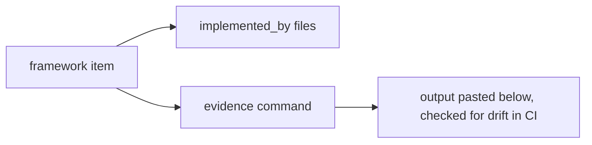

# Regulatory and framework mapping

This page maps the repository's controls to the frameworks a model risk reviewer will ask about. It is
written in this repository's own words, paraphrasing what each reference expects; it is engineering
mapping, not legal advice. The machine-readable version is `regulatory/mapping.yaml`, served by the
MCP tool `regulatory_controls` and printed by `modelrisk regmap`.

## How to read it

Each framework entry lists items (`ref`), a one-line paraphrase, the files that implement it and the
command that produces the evidence. Tests check that every `implemented_by` path exists and every
evidence command runs.



<!-- output: regmap -->
```text
csa-ai-mrm: CSA AI Model Risk Management Framework (pillars) (5 controls)
nist-ai-rmf: NIST AI Risk Management Framework 1.0 (13 controls)
eu-ai-act: EU AI Act (the EU regulation on artificial intelligence) (8 controls)
sr-11-7: SR 11-7 Supervisory Guidance on Model Risk Management (6 controls)
iso-42001: ISO/IEC 42001 AI management system (8 controls)
hipaa: HIPAA Privacy and Security Rules (4 controls)
fair-lending: Fair lending (ECOA and Regulation B, Fair Housing Act) (5 controls)
insurance-ai: State insurance AI expectations (NAIC model bulletin) (1 controls)
```
<!-- /output -->

## CSA AI Model Risk Management Framework (the four pillars)

The Cloud Security Alliance AI Technology and Risk working group frames model risk management around
four tools used together: model cards, data sheets, risk cards, plus scenario planning
([working group page](https://cloudsecurityalliance.org/research/working-groups/ai-technology-and-risk)). This repository implements each as a JSON Schema, a YAML artifact
per model and code, and adds explicit links between them (`docs/pillars/combining-the-pillars.md`).
The framework document is not reproduced or redistributed here.

<!-- output: regmap --framework csa-ai-mrm -->
```text
csa-ai-mrm: CSA AI Model Risk Management Framework (pillars) (5 controls)
ref                    implemented_by
---------------------  ---------------------------------------------------------------
model cards            schemas/model-card.schema.json, src/modelrisk/tiering.py
data sheets            schemas/data-sheet.schema.json, src/modelrisk/combine.py
risk cards             schemas/risk-card.schema.json, src/modelrisk/scoring.py
scenario planning      schemas/scenario.schema.json, src/modelrisk/scenarios/engine.py
combining the pillars  src/modelrisk/combine.py
```
<!-- /output -->

## NIST AI RMF (Govern, Map, Measure, Manage)

* **Govern**: lifecycle roles by tier, sign-offs bound to digests, the audit chain and the CI gate.
* **Map**: model cards record context, intended and out-of-scope uses, and `required_risks` derives risk
  families from that context.
* **Measure**: evaluation, independent validation, scenarios and monitoring produce the numbers.
* **Manage**: residual updates, appetite checks and the generated backlog decide treatment.

<!-- output: regmap --framework nist-ai-rmf -->
```text
nist-ai-rmf: NIST AI Risk Management Framework 1.0 (13 controls)
ref        implemented_by
---------  --------------------------------------------------------------------
GOVERN 1   src/modelrisk/lifecycle.py, docs/best-practices.md
GOVERN 2   schemas/risk-card.schema.json, src/modelrisk/signoff.py
GOVERN 6   registry/pfa-mortgage-flow/model-card.yaml, src/modelrisk/combine.py
MAP 1      schemas/model-card.schema.json
MAP 2      src/modelrisk/tiering.py
MAP 4      schemas/model-card.schema.json
MAP 5      src/modelrisk/scoring.py
MEASURE 1  src/modelrisk/scenarios/engine.py, src/modelrisk/evaluation.py
MEASURE 2  src/modelrisk/scenarios/engine.py, src/modelrisk/validation.py
MEASURE 3  src/modelrisk/monitoring.py
MANAGE 1   src/modelrisk/combine.py
MANAGE 2   src/modelrisk/agents/base.py
MANAGE 4   src/modelrisk/combine.py, src/modelrisk/signoff.py
```
<!-- /output -->

## EU AI Act risk tiers

The Act sorts systems into prohibited practices, high-risk systems, systems with transparency duties
and the rest (minimal). This repository records declared uses on each card and derives a class:
creditworthiness (mortgage) and eligibility for essential services such as health coverage
(healthcare prior authorization) are treated as high-risk; fraud detection is excluded from the
creditworthiness use, so the fraud agent is minimal; customer chat and generated content would carry
transparency duties. High-risk systems need risk management, data governance, technical
documentation, logging, transparency, human oversight, accuracy and robustness, and post-market
monitoring; the table shows where each is implemented.

<!-- output: regmap --framework eu-ai-act -->
```text
eu-ai-act: EU AI Act (the EU regulation on artificial intelligence) (8 controls)
ref      implemented_by
-------  -----------------------------------------------------------
Art. 9   src/modelrisk/combine.py, src/modelrisk/lifecycle.py
Art. 10  schemas/data-sheet.schema.json, src/modelrisk/combine.py
Art. 11  schemas/model-card.schema.json, docs/pillars/model-cards.md
Art. 12  src/modelrisk/signoff.py, infra/terraform/main.tf
Art. 13  schemas/model-card.schema.json
Art. 14  src/modelrisk/agents/graph.py, src/modelrisk/signoff.py
Art. 15  src/modelrisk/scenarios/engine.py
Art. 72  src/modelrisk/monitoring.py
```
<!-- /output -->

## SR 11-7 (model risk management guidance for banks)

Sound development and use, independent validation with effective challenge, governance with an
inventory, and ongoing monitoring. Here: model cards and data sheets (development), `validation.py`
(V1 refuses non-independent validators), inventory and tiering, and `monitoring.py`.

<!-- output: regmap --framework sr-11-7 -->
```text
sr-11-7: SR 11-7 Supervisory Guidance on Model Risk Management (6 controls)
ref                   implemented_by
--------------------  --------------------------------------------------------------
development and use   schemas/model-card.schema.json, schemas/data-sheet.schema.json
conceptual soundness  src/modelrisk/validation.py
ongoing monitoring    src/modelrisk/monitoring.py, src/modelrisk/validation.py
outcomes analysis     src/modelrisk/validation.py, src/modelrisk/evaluation.py
effective challenge   src/modelrisk/validation.py, src/modelrisk/signoff.py
model inventory       registry/inventory.yaml, src/modelrisk/tiering.py
```
<!-- /output -->

## ISO/IEC 42001 (AI management system)

A management system standard: scope, policy, risk assessment and treatment, impact assessment,
operational control, monitoring and improvement. The inventory is the scope, risk cards and residual
updates are assessment and treatment, the gate is operational control, and the backlog is the
improvement loop.

<!-- output: regmap --framework iso-42001 -->
```text
iso-42001: ISO/IEC 42001 AI management system (8 controls)
ref              implemented_by
---------------  -----------------------------------------------------------
6.1.2 and 6.1.3  src/modelrisk/scoring.py, src/modelrisk/combine.py
6.1.4            src/modelrisk/tiering.py, src/modelrisk/scenarios/engine.py
8                src/modelrisk/lifecycle.py
9.1              src/modelrisk/monitoring.py
10               src/modelrisk/combine.py
Annex A.6        src/modelrisk/lifecycle.py
Annex A.7        schemas/data-sheet.schema.json
Annex A.10       registry/inventory.yaml
```
<!-- /output -->

## HIPAA notes (healthcare agent)

Minimum necessary use (the score reads documented features only), masking of PHI identifiers in every
output, audit controls (hash-chained sign-off log, blob diagnostics), and access through managed
identity in the Azure design. The agent carries a "not a medical device" notice. These are design
notes, not a compliance attestation.

<!-- output: regmap --framework hipaa -->
```text
hipaa: HIPAA Privacy and Security Rules (4 controls)
ref                        implemented_by
-------------------------  ----------------------------------------------------------------------
minimum necessary          src/modelrisk/agents/guardrails.py, src/modelrisk/agents/healthcare.py
audit controls             src/modelrisk/signoff.py, infra/terraform/main.tf
not a medical device       src/modelrisk/agents/healthcare.py
prior authorization rules  src/modelrisk/agents/healthcare.py
```
<!-- /output -->

## Fair-lending notes (mortgage agent)

ECOA and Regulation B prohibit discrimination on protected bases in credit and require specific
reasons for adverse action; the Fair Housing Act covers residential lending. Here: protected attributes
and the tract proxy are excluded and tested (DS5, DS6), outcomes are compared with the adverse impact
ratio, individuals with matched pairs, reasons are limited to evidence-backed guideline statements, a
person decides every application, and a less discriminatory alternative search is planned.

<!-- output: regmap --framework fair-lending -->
```text
fair-lending: Fair lending (ECOA and Regulation B, Fair Housing Act) (5 controls)
ref                               implemented_by
--------------------------------  -------------------------------------------------------------------
disparate treatment               src/modelrisk/agents/mortgage.py, src/modelrisk/combine.py
disparate impact                  src/modelrisk/scenarios/engine.py
matched-pair testing              src/modelrisk/agents/mortgage.py, src/modelrisk/scenarios/engine.py
adverse action reasons            src/modelrisk/agents/base.py
less discriminatory alternatives  registry/cedarhollow-underwriting-assistant/risk-cards.yaml
```
<!-- /output -->

## Insurance

<!-- output: regmap --framework insurance-ai -->
```text
insurance-ai: State insurance AI expectations (NAIC model bulletin) (1 controls)
ref                     implemented_by
----------------------  --------------------------------------------------
governance and testing  registry/bramblewood-claims-triage/risk-cards.yaml
```
<!-- /output -->
