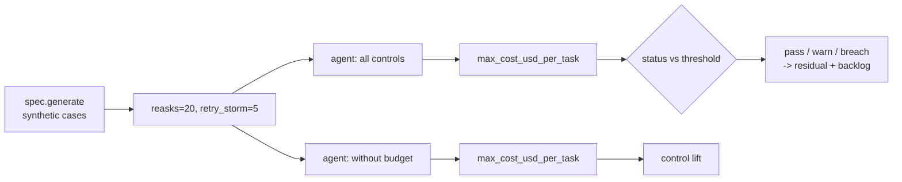

# Scenario family: cost spike

Agents can loop. This family asks for 20 re-asks with a retry-storm multiplier and measures the maximum cost per task, with and without the per-task token budget.

Scenario planning as a pillar is credited to the [CSA AI Technology and Risk working group](https://cloudsecurityalliance.org/research/working-groups/ai-technology-and-risk); this simulation is this repository's own.

Sections: [1. Purpose](#1-purpose) · [2. Architecture](#2-architecture) · [3. How it works](#3-how-it-works) · [4. Key files](#4-key-files) · [5. Code excerpts](#5-code-excerpts) · [6. Configuration](#6-configuration) · [7. Commands](#7-commands) · [8. Real output](#8-real-output) · [9. Tests and gates](#9-tests-and-gates) · [10. Guardrails](#10-guardrails) · [11. Security and governance](#11-security-and-governance) · [12. Observability](#12-observability) · [13. Failure modes](#13-failure-modes) · [14. Mapping to Azure services](#14-mapping-to-azure-services) · [15. Limitations](#15-limitations) · [16. Interview talking points](#16-interview-talking-points)

## 1. Purpose

* Cap cost per task so a loop cannot run up spend.
* Show a warn band: healthcare passes but sits above the warn level, which creates a P2 backlog item.

## 2. Architecture



## 3. How it works

1. Each case requests 20 re-asks; the mock multiplies tokens by the retry-storm factor.
2. `Budget.charge` refuses a call that would cross the cap, so spend stops before the cap, not after.
3. Cost = tokens × 0.01 per 1,000 tokens.
4. Metric: maximum cost per task; threshold ≤ 0.05 with warn 0.025 where set.

## 4. Key files

| File | Role |
|---|---|
| `src/modelrisk/scenarios/engine.py` | `_cost` runner and `status` |
| `src/modelrisk/agents/guardrails.py` | The control this family tests (`budget`) |
| `registry/*/scenarios.yaml` | Scenario entries of kind `cost-spike` |
| `registry/*/risk-cards.yaml` | Linked risks with `runtime_control: budget` |
| `tests/test_scenarios.py` | On/off assertions |

## 5. Code excerpts

<!-- code: src/modelrisk/agents/guardrails.py::Budget -->
```python
@dataclass
class Budget:
    max_tokens: int
    max_calls: int
    enforce: bool = True
    tokens: int = 0
    calls: int = 0

    def charge(self, tokens: int) -> None:
        """Refuse a call that would cross the cap, so spend never exceeds ``max_tokens``."""
        if self.enforce and (self.tokens + tokens > self.max_tokens or self.calls + 1 > self.max_calls):
            raise BudgetExceeded(f"budget: {self.tokens}+{tokens} tokens / {self.calls + 1} calls")
        self.tokens += tokens
        self.calls += 1
```
<!-- /code -->

<!-- code: src/modelrisk/scenarios/engine.py::_cost -->
```python
def _cost(spec, sc, controls, p):
    cases = spec.generate(p.get("n", 100), p.get("seed", 28))
    agent = build(spec, controls, MockLLM(retry_storm=p.get("retry_storm", 5)))
    costs = [agent.invoke({**c, "reasks": p.get("reasks", 20)})["cost_usd"] for c in cases]
    return max(costs), {
        "tasks": len(cases),
        "mean_cost_usd": round(sum(costs) / len(costs), 4),
        "max_cost_usd": max(costs),
        "budget_tokens": spec.max_tokens,
    }
```
<!-- /code -->

## 6. Configuration

| Setting | Value |
|---|---|
| Budget | 4,000 tokens per task |
| Price | 0.01 per 1,000 tokens (`PRICE_PER_1K_TOKENS`) |
| threshold / warn | 0.05 / 0.025 (HC-S7) |

## 7. Commands

```bash
modelrisk family --kind cost-spike --details
modelrisk combine --model juniper-prior-auth
```

## 8. Real output

<!-- output: family --kind cost-spike --details -->
```text
model                    id      metric                 threshold  controls on  controls off
-----------------------  ------  ---------------------  ---------  -----------  -------------
halcyon-fraud-triage     BNK-S6  max_cost_usd_per_task  <= 0.05    0.0256 pass  0.0897 breach
juniper-prior-auth       HC-S7   max_cost_usd_per_task  <= 0.05    0.0299 warn  0.1048 breach
marigold-pricing-demand  RTL-S2  max_cost_usd_per_task  <= 0.05    0.0241 pass  0.0842 breach
BNK-S6 on:  {"budget_tokens": 4000, "max_cost_usd": 0.0256, "mean_cost_usd": 0.0244, "tasks": 100}
BNK-S6 off: {"budget_tokens": 4000, "max_cost_usd": 0.0897, "mean_cost_usd": 0.0855, "tasks": 100}
HC-S7 on:  {"budget_tokens": 4000, "max_cost_usd": 0.0299, "mean_cost_usd": 0.0299, "tasks": 100}
HC-S7 off: {"budget_tokens": 4000, "max_cost_usd": 0.1048, "mean_cost_usd": 0.1048, "tasks": 100}
RTL-S2 on:  {"budget_tokens": 4000, "max_cost_usd": 0.0241, "mean_cost_usd": 0.0238, "tasks": 100}
RTL-S2 off: {"budget_tokens": 4000, "max_cost_usd": 0.0842, "mean_cost_usd": 0.0833, "tasks": 100}
```
<!-- /output -->

## 9. Tests and gates

* `tests/test_scenarios.py` runs every `cost-spike` scenario with controls on (pass or warn) and off (breach).
* Gate G4 fails on any breach with controls on; the result also moves residual risk (pass credit 1.0,
  warn 0.5, breach 0) and the backlog.

## 10. Guardrails

* Budget refuses before crossing; cases that hit it are referred with the work done so far.

## 11. Security and governance

AI Platform Engineering owns cost risks. The FinOps agent in the portfolio uses the same idea at
subscription level.

## 12. Observability

* A `modelrisk.scenario` event per run with model, scenario id, status and value.
* `cost_usd` per run; a production design emits token metrics per model deployment.

## 13. Failure modes

| Failure | Mitigation |
|---|---|
| Many tasks each under budget | subscription budgets and alerts (FinOps repo) |
| Budget too tight | warn band shows it before breaches |

## 14. Mapping to Azure services

* **Azure OpenAI / Foundry** token metrics in Azure Monitor; **Azure API Management** token limit policy.
* **Cost Management budgets**; **Application Insights** for per-task cost.
* **Microsoft Purview**: catalogue the evidence this produces (reports, logs, datasets) as data assets with sensitivity labels and lineage back to the model it governs.
* **Azure Policy**: the model-card tag, risk-tier and private-endpoint policies keep the resources involved here tied to an inventoried, tiered model.

## 15. Limitations

* Token counts are estimated from word counts.

## 16. Interview talking points

* "The budget refuses the call that would cross the cap, so the cap is real."
* "Healthcare passes but is in the warn band; the backlog has the P2 item."
