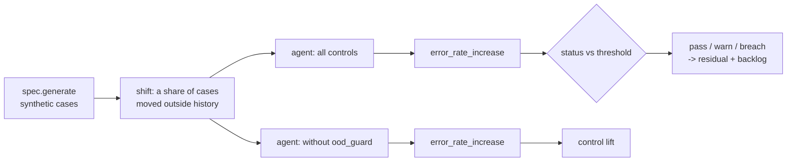

# Scenario family: data drift

What happens when production inputs stop looking like the development data? This family mixes a share of shifted cases into a fresh sample and measures how much worse the agent gets on the cases it still handles automatically.

Scenario planning as a pillar is credited to the [CSA AI Technology and Risk working group](https://cloudsecurityalliance.org/research/working-groups/ai-technology-and-risk); this simulation is this repository's own.

Sections: [1. Purpose](#1-purpose) · [2. Architecture](#2-architecture) · [3. How it works](#3-how-it-works) · [4. Key files](#4-key-files) · [5. Code excerpts](#5-code-excerpts) · [6. Configuration](#6-configuration) · [7. Commands](#7-commands) · [8. Real output](#8-real-output) · [9. Tests and gates](#9-tests-and-gates) · [10. Guardrails](#10-guardrails) · [11. Security and governance](#11-security-and-governance) · [12. Observability](#12-observability) · [13. Failure modes](#13-failure-modes) · [14. Mapping to Azure services](#14-mapping-to-azure-services) · [15. Limitations](#15-limitations) · [16. Interview talking points](#16-interview-talking-points)

## 1. Purpose

* Quantify the cost of drift on decisions the model actually makes (cases flagged out of range go to a
  person and are excluded from the error rate).
* Prove the out-of-range guard: without it, drifted cases are scored with false confidence and the
  error rate jumps.

## 2. Architecture



## 3. How it works

1. Generate a reference sample and a current sample with the same seed, the second with `shift` (for
   example 0.3) of cases replaced by drifted profiles that each domain defines (fraud bursts, staged
   shelf-policy claims, very high stated income, promotion shocks, new referral patterns).
2. Run the agent on both. `_automated_error` counts errors only on cases without an `out-of-range` flag.
3. Metric = current error minus reference error; details report PSI of scores and of one feature, the
   count of flagged cases and the count still model-supported.
4. Without `ood_guard`, drifted cases reach the model and the increase breaches 0.05.

## 4. Key files

| File | Role |
|---|---|
| `src/modelrisk/scenarios/engine.py` | `_drift` runner and `status` |
| `src/modelrisk/agents/base.py` | The control this family tests (`ood_guard`) |
| `registry/*/scenarios.yaml` | Scenario entries of kind `data-drift` |
| `registry/*/risk-cards.yaml` | Linked risks with `runtime_control: ood_guard` |
| `tests/test_scenarios.py` | On/off assertions |

## 5. Code excerpts

<!-- code: src/modelrisk/scenarios/engine.py::_automated_error -->
```python
def _automated_error(spec: AgentSpec, results: list[dict], cases: list[dict]) -> tuple[float, int]:
    """Error rate on outputs the agent delivered as model-supported (no out-of-range flag).
    Flagged cases are handled by a person without the model's recommendation."""
    auto = [(r, c) for r, c in zip(results, cases, strict=True) if not any(f.startswith("out-of-range") for f in r["flags"])]
    if not auto:
        return 0.0, 0
    wrong = sum((r["decision"] in spec.positive) != spec.label(c) for r, c in auto)
    return wrong / len(auto), len(auto)
```
<!-- /code -->

<!-- code: src/modelrisk/scenarios/engine.py::psi -->
```python
def psi(ref: list[float], cur: list[float], bins: int = 10) -> float:
    """Population stability index over quantile bins of the reference sample."""
    s = sorted(ref)
    edges = [s[int(len(s) * i / bins)] for i in range(1, bins)]

    def shares(xs: list[float]) -> list[float]:
        counts = [0] * bins
        for v in xs:
            counts[sum(v > e for e in edges)] += 1
        return [max(c / len(xs), 1e-4) for c in counts]

    return round(sum((c - r) * math.log(c / r) for r, c in zip(shares(ref), shares(cur), strict=True)), 4)
```
<!-- /code -->

<!-- code: src/modelrisk/agents/base.py::out_of_range -->
```python
def out_of_range(spec: AgentSpec, x: dict[str, float]) -> list[str]:
    return [f for f in spec.features if not (spec.ranges[f][0] <= x[f] <= spec.ranges[f][1])]
```
<!-- /code -->

## 6. Configuration

| Parameter | Typical | Meaning |
|---|---|---|
| `shift` | 0.3 | share of drifted cases |
| `feature` | domain specific | feature whose PSI is reported |
| threshold | ≤ 0.05 | error-rate increase |
| PSI levels (monitoring) | warn 0.1, alert 0.25 | from the model card |

## 7. Commands

```bash
modelrisk family --kind data-drift --details
modelrisk monitor --model marigold-pricing-demand --shift 0.3
```

## 8. Real output

<!-- output: family --kind data-drift --details -->
```text
model                               id      metric               threshold  controls on   controls off
----------------------------------  ------  -------------------  ---------  ------------  -------------
halcyon-fraud-triage                BNK-S1  error_rate_increase  <= 0.05    0.0073 pass   0.285 breach
bramblewood-claims-triage           INS-S1  error_rate_increase  <= 0.05    0.0135 pass   0.225 breach
cedarhollow-underwriting-assistant  MTG-S6  error_rate_increase  <= 0.05    -0.0018 pass  0.14 breach
juniper-prior-auth                  HC-S8   error_rate_increase  <= 0.05    -0.018 pass   0.1783 breach
marigold-pricing-demand             RTL-S1  error_rate_increase  <= 0.05    -0.0025 pass  0.1817 breach
BNK-S1 on:  {"error_drifted": 0.1457, "error_ref": 0.1383, "flagged_out_of_range": 195, "model_supported": 405, "psi_device_age_days": 0.5473, "psi_score": 0.5803}
BNK-S1 off: {"error_drifted": 0.4233, "error_ref": 0.1383, "flagged_out_of_range": 0, "model_supported": 600, "psi_device_age_days": 0.5473, "psi_score": 0.5803}
INS-S1 on:  {"error_drifted": 0.2402, "error_ref": 0.2267, "flagged_out_of_range": 167, "model_supported": 433, "psi_policy_age_months": 0.3989, "psi_score": 0.4159}
INS-S1 off: {"error_drifted": 0.4517, "error_ref": 0.2267, "flagged_out_of_range": 0, "model_supported": 600, "psi_policy_age_months": 0.3989, "psi_score": 0.4159}
MTG-S6 on:  {"error_drifted": 0.2265, "error_ref": 0.2283, "flagged_out_of_range": 185, "model_supported": 415, "psi_income_k": 0.5082, "psi_score": 0.0274}
MTG-S6 off: {"error_drifted": 0.3683, "error_ref": 0.2283, "flagged_out_of_range": 0, "model_supported": 600, "psi_income_k": 0.5082, "psi_score": 0.0274}
HC-S8 on:  {"error_drifted": 0.342, "error_ref": 0.36, "flagged_out_of_range": 179, "model_supported": 421, "psi_conservative_weeks": 2.5067, "psi_score": 0.4742}
HC-S8 off: {"error_drifted": 0.5383, "error_ref": 0.36, "flagged_out_of_range": 0, "model_supported": 600, "psi_conservative_weeks": 2.5067, "psi_score": 0.4742}
RTL-S1 on:  {"error_drifted": 0.2759, "error_ref": 0.2783, "flagged_out_of_range": 165, "model_supported": 435, "psi_demand_index": 0.4078, "psi_score": 0.4203}
RTL-S1 off: {"error_drifted": 0.46, "error_ref": 0.2783, "flagged_out_of_range": 0, "model_supported": 600, "psi_demand_index": 0.4078, "psi_score": 0.4203}
```
<!-- /output -->

Monitoring sees the same drift as a PSI alert:

<!-- output: monitor --model marigold-pricing-demand --shift 0.3 -->
```text
monitoring window for marigold-pricing-demand: 500 cases, shift 0.3 -> ALERT
check                  value   status
---------------------  ------  ------
psi:price_gap_pct      0.0228  ok
psi:demand_index       0.5012  alert
psi:stock_cover_weeks  0.0072  ok
psi:elasticity         0.0417  ok
psi:margin_pct         0.0158  ok
psi:score              0.4434  alert
perf:precision         0.1796  alert
action: Route every case to a human, open a revalidation item and notify the model owner.
```
<!-- /output -->

## 9. Tests and gates

* `tests/test_scenarios.py` runs every `data-drift` scenario with controls on (pass or warn) and off (breach).
* Gate G4 fails on any breach with controls on; the result also moves residual risk (pass credit 1.0,
  warn 0.5, breach 0) and the backlog.

## 10. Guardrails

* Out-of-range inputs never get an automated decision.
* Monitoring alerts on PSI and performance windows independently of this scenario.

## 11. Security and governance

Drift is a model risk owner concern (the business owner of each model owns its drift risk, e.g.
BNK-R1). Validation re-runs the drift check on a different seed.

## 12. Observability

* A `modelrisk.scenario` event per run with model, scenario id, status and value.
* `modelrisk.drift` events with PSI per feature from `monitor`; workbook drift panel.

## 13. Failure modes

| Failure | Signal |
|---|---|
| Drift inside the documented ranges | not caught by the guard; caught by monitoring performance windows |
| Ranges set too wide | guard never fires; DS4 keeps ranges equal to code, reviewers judge width |
| Labels arrive late | performance monitoring lags; PSI still alerts |

## 14. Mapping to Azure services

* **Azure Machine Learning data drift monitors** or **Foundry continuous evaluation** in place of `monitor`.
* **Application Insights** custom events and alert rules on PSI.
* **Purview** lineage to find which upstream source changed.
* **Azure Policy** keeps diagnostic settings on so the telemetry exists.

## 15. Limitations

* Drifted profiles are designed per domain, so they are cleaner than real drift.
* PSI uses ten equal-width bins.

## 16. Interview talking points

* "I measure error only on decisions the model still makes; flagged cases are with people."
* "Turn the guard off and the error increase breaches. That is the evidence the control matters."
