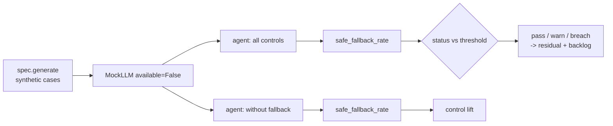

# Scenario family: model outage and fallback

Hosted models go down. This family makes the language model unavailable for every case and checks that each one ends in a safe, human-handled state instead of an error or a silent automated decision.

Scenario planning as a pillar is credited to the [CSA AI Technology and Risk working group](https://cloudsecurityalliance.org/research/working-groups/ai-technology-and-risk); this simulation is this repository's own.

Sections: [1. Purpose](#1-purpose) · [2. Architecture](#2-architecture) · [3. How it works](#3-how-it-works) · [4. Key files](#4-key-files) · [5. Code excerpts](#5-code-excerpts) · [6. Configuration](#6-configuration) · [7. Commands](#7-commands) · [8. Real output](#8-real-output) · [9. Tests and gates](#9-tests-and-gates) · [10. Guardrails](#10-guardrails) · [11. Security and governance](#11-security-and-governance) · [12. Observability](#12-observability) · [13. Failure modes](#13-failure-modes) · [14. Mapping to Azure services](#14-mapping-to-azure-services) · [15. Limitations](#15-limitations) · [16. Interview talking points](#16-interview-talking-points)

## 1. Purpose

* Every case must fall back to a person with the score and thresholds attached.
* Without fallback the exception propagates and cases are lost.

## 2. Architecture



## 3. How it works

1. Build the agent with `MockLLM(available=False)`; `complete` raises `ModelUnavailable`.
2. With `fallback` on, the explain node catches it, flags `model-outage-fallback` and routes to a person.
3. With it off, the exception escapes and the runner counts unhandled errors.
4. Metric: share of cases in `awaiting-human` with the fallback flag; threshold ≥ 1.0.

## 4. Key files

| File | Role |
|---|---|
| `src/modelrisk/scenarios/engine.py` | `_outage` runner and `status` |
| `src/modelrisk/agents/base.py` | The control this family tests (`fallback`) |
| `registry/*/scenarios.yaml` | Scenario entries of kind `model-outage` |
| `registry/*/risk-cards.yaml` | Linked risks with `runtime_control: fallback` |
| `tests/test_scenarios.py` | On/off assertions |

## 5. Code excerpts

<!-- code: src/modelrisk/agents/llm.py::ModelUnavailable -->
```python
class ModelUnavailable(Exception):
    pass
```
<!-- /code -->

<!-- code: src/modelrisk/scenarios/engine.py::_outage -->
```python
def _outage(spec, sc, controls, p):
    cases = spec.generate(p.get("n", 200), p.get("seed", 24))
    agent = build(spec, controls, MockLLM(available=False))
    safe, crashed = 0, 0
    for c in cases:
        try:
            r = agent.invoke(c)
            safe += r["status"] == "awaiting-human" and "model-outage-fallback" in r["flags"]
        except ModelUnavailable:
            crashed += 1
    return round(safe / len(cases), 4), {"cases": len(cases), "safe_fallback": safe, "unhandled_errors": crashed}
```
<!-- /code -->

## 6. Configuration

| Parameter | Meaning |
|---|---|
| threshold | ≥ 1.0, every case safe |
| fallback target | the human queue named on the model card (`system.fallback`) |

## 7. Commands

```bash
modelrisk family --kind model-outage --details
```

## 8. Real output

<!-- output: family --kind model-outage --details -->
```text
model                               id      metric              threshold  controls on  controls off
----------------------------------  ------  ------------------  ---------  -----------  ------------
halcyon-fraud-triage                BNK-S4  safe_fallback_rate  >= 1.0     1.0 pass     0.0 breach
bramblewood-claims-triage           INS-S4  safe_fallback_rate  >= 1.0     1.0 pass     0.0 breach
cedarhollow-underwriting-assistant  MTG-S7  safe_fallback_rate  >= 1.0     1.0 pass     0.0 breach
juniper-prior-auth                  HC-S5   safe_fallback_rate  >= 1.0     1.0 pass     0.0 breach
marigold-pricing-demand             RTL-S5  safe_fallback_rate  >= 1.0     1.0 pass     0.0 breach
BNK-S4 on:  {"cases": 200, "safe_fallback": 200, "unhandled_errors": 0}
BNK-S4 off: {"cases": 200, "safe_fallback": 0, "unhandled_errors": 200}
INS-S4 on:  {"cases": 200, "safe_fallback": 200, "unhandled_errors": 0}
INS-S4 off: {"cases": 200, "safe_fallback": 0, "unhandled_errors": 200}
MTG-S7 on:  {"cases": 200, "safe_fallback": 200, "unhandled_errors": 0}
MTG-S7 off: {"cases": 200, "safe_fallback": 0, "unhandled_errors": 200}
HC-S5 on:  {"cases": 200, "safe_fallback": 200, "unhandled_errors": 0}
HC-S5 off: {"cases": 200, "safe_fallback": 0, "unhandled_errors": 200}
RTL-S5 on:  {"cases": 200, "safe_fallback": 200, "unhandled_errors": 0}
RTL-S5 off: {"cases": 200, "safe_fallback": 0, "unhandled_errors": 200}
```
<!-- /output -->

## 9. Tests and gates

* `tests/test_scenarios.py` runs every `model-outage` scenario with controls on (pass or warn) and off (breach).
* Gate G4 fails on any breach with controls on; the result also moves residual risk (pass credit 1.0,
  warn 0.5, breach 0) and the backlog.

## 10. Guardrails

* Fallback is a required model-card field; the schema rejects a card without one.

## 11. Security and governance

AI Platform Engineering owns outage risks in every domain.

## 12. Observability

* A `modelrisk.scenario` event per run with model, scenario id, status and value.
* Flag `model-outage-fallback`; a production design alerts on the fallback rate.

## 13. Failure modes

| Failure | Mitigation |
|---|---|
| Partial outage (timeouts) | same path with timeouts and retries within budget |
| Human queue overwhelmed | capacity plan; tier 1 models have the queue named |

## 14. Mapping to Azure services

* **Foundry** deployments in two regions or provisioned throughput; **Azure API Management** for
  failover between deployments.
* **Application Insights** availability and dependency failure alerts.

## 15. Limitations

* All-or-nothing outage; no latency degradation is simulated.

## 16. Interview talking points

* "Outage is a scenario, not an incident: every case lands with a person, measured at 100%."
