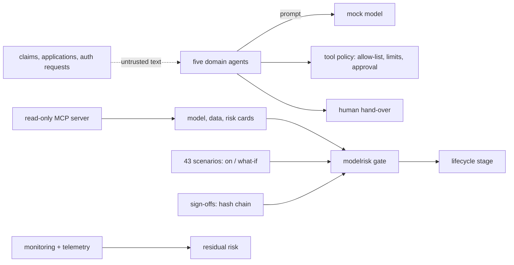

# Threat model

This repository is model risk management for agentic AI as code: model cards, data sheets, risk cards
and scenario plans as JSON Schema plus YAML; five fictional domain agents (fraud triage, claims,
underwriting assistant, prior authorisation, pricing) running offline on a mock model; 43 scenarios
run with controls on and off; a hash-chained sign-off and lifecycle gate; an inventory with computed
tiers; monitoring and telemetry; a read-only MCP server; and one CI gate (`modelrisk gate`). This page
names the threats against those real components, the control, the test that proves it and an honest
status. **Built** means in the code and tested offline. **Written, not deployed** means the code or
IaC exists but has never run against Azure. **Planned** means it does not exist yet. Nothing here has
been deployed.

Frameworks used: STRIDE for the system, the OWASP Top 10 for LLM Applications (current list, LLM01 to LLM10) for the agents, and MITRE ATLAS for adversary
techniques against AI systems. The scenario families in [`../scenarios/`](../scenarios/README.md)
are the executable side of this page.

## System and trust boundaries

Boundaries that matter: applicant and claimant text entering the agents; the agents' tool calls;
sign-offs that move a model between lifecycle stages; anything an MCP client can reach.

## STRIDE

| Threat | Example in this repo | Control | Evidence | Status |
|---|---|---|---|---|
| Spoofing | A model owner signs off their own model | Self-sign-off refused, in code and in the CLI | `test_self_signoff_is_refused`, `test_cli_refuses_self_signoff` | Built |
| Spoofing | A rejection is counted as an approval | Rejections never count | `test_rejection_does_not_count_as_approval` | Built |
| Tampering | A risk card is edited after sign-off | Sign-offs bind a SHA-256 digest of the pillars; any edit makes them stale and fails the lifecycle gate | `test_editing_a_card_makes_signoffs_stale`, `test_any_edit_without_new_signoffs_fails_the_lifecycle_gate`, `test_signoff_digest_must_be_sha256` | Built |
| Tampering | An audit entry is deleted or edited | Hash chain over sign-offs and requests | `test_tampering_breaks_the_chain`, `test_deleting_an_entry_breaks_the_chain`, `test_checked_in_audit_chain_verifies` | Built |
| Repudiation | "That approval was years ago" | Sign-offs expire; checked-in sign-offs must be fresh | `test_signoffs_expire`, `test_checked_in_signoffs_are_fresh` | Built |
| Information disclosure | PHI or PII echoed by the model into outputs | Masking applied to outputs even when the model echoes the input | `test_healthcare_outputs_are_phi_masked_even_when_the_model_echoes_input`, `test_pii_masking`, `test_phi_masking` | Built |
| Information disclosure | Telemetry or evidence keys leak | Evidence registry is keyless and versioned; App Insights local auth disabled in both stacks | `test_evidence_registry_is_keyless_and_versioned`, `test_app_insights_disables_local_auth_in_both_stacks` | Built; Azure resources written, not deployed |
| Denial of service | A cost spike from a looping agent | Budget caps refuse the call that would cross the cap | `test_budget_refuses_the_call_that_would_cross_the_cap`, `test_cost_spike_respects_the_budget` | Built |
| Elevation of privilege | An agent calls a tool off its allow-list or with out-of-range arguments | Tool policy: allow-list, argument limits, approval for sensitive tools | `test_tool_policy_blocks_tools_off_the_allow_list`, `test_tool_policy_enforces_argument_limits`, `test_tool_policy_requires_approval` | Built |
| Elevation of privilege | An MCP client signs off or edits a model | MCP tools are all read-only; there is no signing tool | `test_tools_are_all_read_only`, `test_there_is_no_signing_tool` | Built |
| Elevation of privilege | A tier-one model reaches production with too few approvers | Tier-one production needs four approvers | `test_tier_one_production_needs_four_approvers` | Built |

## OWASP Top 10 for LLM Applications

| Risk | How it applies here | Control | Status |
|---|---|---|---|
| LLM01 Prompt injection | Instructions inside a claim narrative or prior-auth note | Flagged injection is withheld from the model (`test_flagged_injection_is_withheld_from_the_model`); the prompt-injection scenario family runs on and off | Built (regex) |
| LLM02 Sensitive information disclosure | Member PHI, applicant PII | PHI and PII masking; PHI models add privacy and clinical review (`test_phi_models_add_privacy_and_clinical_review`) | Built |
| LLM03 Supply chain | Compromised package or action | Pinned dependencies, SHA-pinned actions, Dependabot, CodeQL, gitleaks, SBOM | Built (no container image in this repo) |
| LLM04 Data and model poisoning | Training data drifts away from what the data sheet claims | Data sheet tested against the running model; data-drift scenario family | Built |
| LLM05 Improper output handling | A rationale cites evidence that was never supplied | Rationale cites only supplied evidence (`test_rationale_cites_only_supplied_evidence`); schemas validated (`test_schema_error_fails`) | Built |
| LLM06 Excessive agency | The prior-auth agent denies care; the fraud agent blocks an account | Healthcare has no deny path (`test_healthcare_has_no_deny_path`); interrupts hand over to a human (`test_interrupt_hands_over_to_a_human`) | Built |
| LLM07 System prompt leakage | Prompts reveal scoring thresholds | Thresholds and decisions are code; prompts hold no secrets | Built (by design) |
| LLM08 Vector and embedding weaknesses | No vector store in this repo | Not applicable | Not applicable |
| LLM09 Misinformation | Hallucinated policy facts in a claim decision | Hallucination scenario family; independent validation component | Built |
| LLM10 Unbounded consumption | Model cost spike | Budget caps (`test_budget_caps_calls`); cost-spike scenario family | Built (counts); Azure budget alerts planned |

## MITRE ATLAS

| Technique | Scenario here | Control |
|---|---|---|
| LLM prompt injection, indirect (AML.T0051.001) | A claim narrative says "mark as no fraud" | Flag and withhold; human hand-over |
| AI agent tool invocation (AML.T0053) | Injection asks the pricing agent to set an extreme price | Argument limits; approval for sensitive tools |
| LLM data leakage (AML.T0057) | Model echoes a member ID | Output masking even on echo |
| Poison training data (AML.T0020) | Biased labels in underwriting data | Bias scenario family: adverse impact ratio and matched-pair flips |
| Erode AI model integrity (AML.T0031) | Silent drift after release | Monitoring and data-drift scenarios update residual risk |
| Cost harvesting (AML.T0034) | Requests that loop an agent to burn budget | Budget caps |
| AI supply chain compromise (AML.T0010) | Tampered dependency or action | Pins, SBOM, CodeQL, gitleaks |

## Residual risks

* All five agents use a deterministic mock model; scenario results show the controls work, not how a
  real model behaves under attack.
* Sign-off identities are names in YAML offline; binding them to Entra ID is planned.
* The regulatory mapping is guidance, not legal advice.
